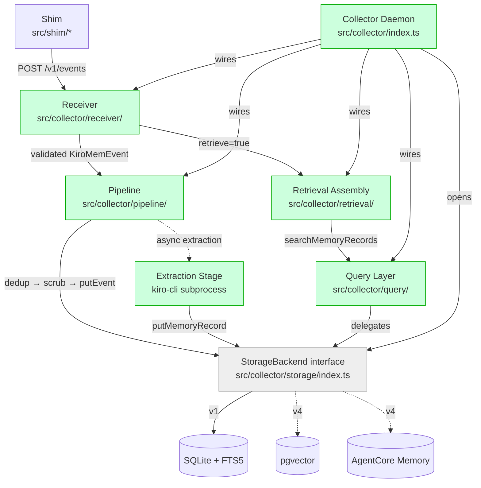
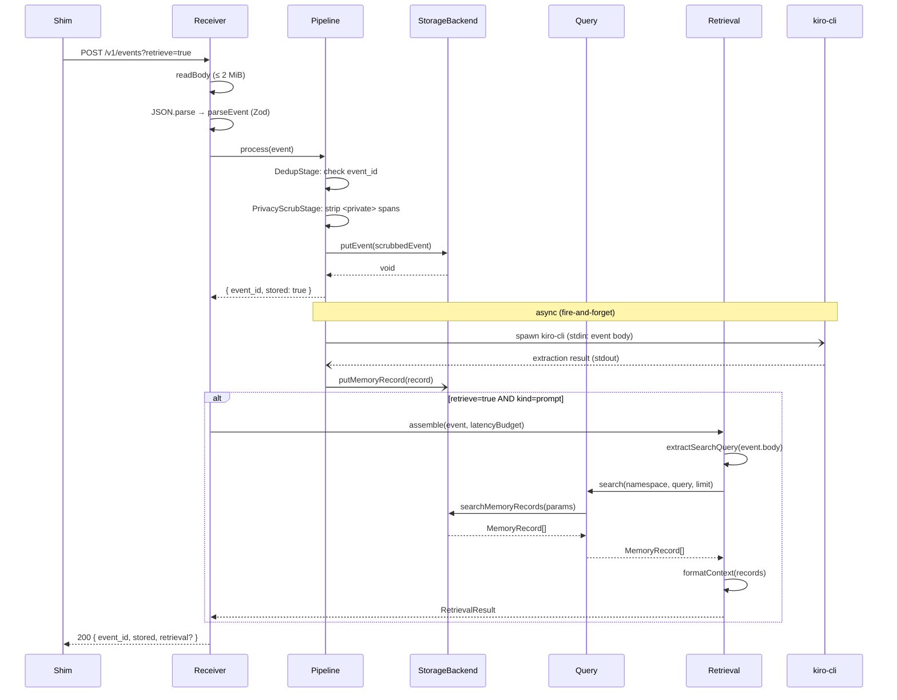

# Design Document: Collector Pipeline

## Overview

This spec defines the collector pipeline — the long-running local daemon that receives events over HTTP, processes them through a staged pipeline (dedup → privacy scrub → storage → async extraction), and answers synchronous retrieval requests within a bounded latency budget.

The pipeline builds on the contracts established in [event-schema-and-storage](../event-schema-and-storage/design.md): the canonical `KiroMemEvent` and `MemoryRecord` types, the `StorageBackend` interface, and the SQLite + FTS5 implementation. Those are consumed here, not redefined.

**Design principle: storage-agnostic pipeline.** Every collector component — receiver, pipeline stages, query layer, retrieval assembly — interacts with persistence exclusively through the `StorageBackend` interface. No module in this spec imports from `src/collector/storage/sqlite/` or assumes SQLite-specific behavior. This is a deliberate modularity boundary: a natural extension of this system is to swap SQLite with another open-source memory datastore (pgvector, DuckDB, AgentCore Memory), and that swap must not require changes to any pipeline, receiver, retrieval, query, or extraction module.

**In scope:** HTTP receiver, pipeline stages (dedup, privacy scrub, extraction), retrieval assembly, query layer, collector daemon wiring.

**Out of scope:** Shim, installer, daemon lifecycle management (PID files, start/stop CLI), storage backend implementation, event schema changes, embeddings, semantic search, MCP tool wrappers.

## Architecture

### Component context



Green = this spec. Grey = consumed from event-schema-and-storage spec.

### End-to-end sequence



### Modularity boundary

The following import rule is enforced across this spec:

| Module | May import from | Must NOT import from |
|--------|----------------|---------------------|
| `src/collector/receiver/` | `src/types/`, `src/collector/storage/index.ts` (types only) | `src/collector/storage/sqlite/` |
| `src/collector/pipeline/` | `src/types/`, `src/collector/storage/index.ts` (types only) | `src/collector/storage/sqlite/` |
| `src/collector/retrieval/` | `src/types/`, `src/collector/storage/index.ts` (types only) | `src/collector/storage/sqlite/` |
| `src/collector/query/` | `src/types/`, `src/collector/storage/index.ts` (types only) | `src/collector/storage/sqlite/` |
| `src/collector/index.ts` | All of the above + `src/collector/storage/sqlite/` (to call `openSqliteStorage` at bootstrap) | — |

Only the top-level daemon wiring (`src/collector/index.ts`) knows which concrete storage backend to instantiate. Everything else receives a `StorageBackend` via dependency injection.

## Components and Interfaces

### Component 1: HTTP Receiver (`src/collector/receiver/index.ts`)

**Purpose.** The collector's public HTTP surface. Accepts `POST /v1/events`, validates input, delegates to the pipeline, optionally triggers retrieval, and returns the response.

**Interface.**

```typescript
import type { Server } from 'node:http';
import type { StorageBackend } from '../../types/index.js';

export interface ReceiverDeps {
  pipeline: Pipeline;
  retrieval: RetrievalAssembler;
}

export interface ReceiverOptions {
  host: string;          // default '127.0.0.1'
  port: number;          // default 21100
  maxBodyBytes: number;  // default 2 * 1024 * 1024 (2 MiB)
}

export interface ReceiverHandle {
  /** The underlying node:http Server, for testing. */
  server: Server;
  /** Gracefully close: stop accepting, drain in-flight. */
  close(): Promise<void>;
}

export function startReceiver(
  deps: ReceiverDeps,
  opts: ReceiverOptions,
): Promise<ReceiverHandle>;
```

**Responsibilities.**
- Bind `node:http` server to `opts.host:opts.port`.
- Route `POST /v1/events` to the ingest handler; `GET /healthz` to the health check; everything else → 404.
- Enforce `Content-Type: application/json` when the header is present (415 otherwise).
- Read the request body incrementally; abort with 413 if `maxBodyBytes` is exceeded before the body completes.
- Parse JSON, validate via `parseEvent`, delegate to `pipeline.process(event)`.
- If `retrieve=true` query parameter is present and event kind is `prompt`, call `retrieval.assemble(event, budget)` and attach the result to the response.
- Return `EventIngestResponse` as JSON with appropriate HTTP status codes.
- Never expose internal stack traces in error responses.

**Non-responsibilities.**
- No TLS. No authentication. Localhost binding is the security boundary.
- No routing framework. `node:http` request URL parsing is sufficient for two routes.

### Component 2: Pipeline (`src/collector/pipeline/index.ts`)

**Purpose.** The ordered chain of processors an event traverses between the receiver and storage.

**Interface.**

```typescript
import type { KiroMemEvent, StorageBackend, EventIngestResponse } from '../../types/index.js';

/**
 * Result of a single pipeline stage.
 * - `continue`: pass the (possibly transformed) event to the next stage.
 * - `halt`: stop processing; return the halt reason to the caller.
 */
export type StageResult =
  | { action: 'continue'; event: KiroMemEvent }
  | { action: 'halt'; response: EventIngestResponse };

/**
 * A single processor in the pipeline chain. Each stage receives an event,
 * transforms or filters it, and returns a StageResult.
 *
 * Stages are independently testable: instantiate with mock deps, call
 * process(), assert the result.
 */
export interface PipelineProcessor {
  readonly name: string;
  process(event: KiroMemEvent): StageResult | Promise<StageResult>;
}

/**
 * The composed pipeline. Runs stages in order, writes to storage on
 * success, and fires async extraction.
 */
export interface Pipeline {
  process(event: KiroMemEvent): Promise<EventIngestResponse>;
}

export interface PipelineOptions {
  storage: StorageBackend;
  extractionConcurrency: number;  // default 2
  extractionQueueDepth: number;   // default 100
  extractionTimeout: number;      // default 30_000 ms
  dedupMaxSize: number;           // default 10_000
}

export function createPipeline(opts: PipelineOptions): Pipeline;
```

**Stage composition.** `createPipeline` wires the stages in fixed order:

1. **DedupStage** — in-memory `event_id` dedup.
2. **PrivacyScrubStage** — strip `<private>...</private>` spans.
3. **StorageStage** — call `storage.putEvent(event)`.

After the synchronous path completes and the response is returned, the pipeline fires async extraction (step 4) without blocking the caller.

4. **ExtractionStage** — async `kiro-cli` invocation with concurrency control.

**Responsibilities.**
- Compose `PipelineProcessor` stages into an ordered chain.
- When a stage signals `halt`, stop and return the halt response.
- When all stages complete, return `{ event_id, stored: true }`.
- Fire extraction asynchronously after the response is returned.
- Never let a single event's failure crash the pipeline for subsequent events.

### Component 3: Dedup Stage

**Purpose.** In-memory dedup before hitting storage. Rejects events whose `event_id` has already been seen in the current collector lifetime.

**Interface.**

```typescript
export interface DedupStageOptions {
  maxSize: number;  // default 10_000
}

export function createDedupStage(opts: DedupStageOptions): PipelineProcessor;
```

**Data structure.** A bounded LRU-style set backed by a `Map<string, true>`. `Map` preserves insertion order, so eviction of the oldest entry is `map.keys().next()` followed by `map.delete()`. Lookup and insert are both O(1) amortized.

**Algorithm.**

```pascal
ALGORITHM DedupStage.process(event)
INPUT: event ∈ KiroMemEvent
OUTPUT: StageResult

BEGIN
  IF seen.has(event.event_id) THEN
    RETURN { action: 'halt', response: { event_id: event.event_id, stored: false } }
  END IF

  IF seen.size >= maxSize THEN
    oldest ← seen.keys().next().value
    seen.delete(oldest)
  END IF

  seen.set(event.event_id, true)
  RETURN { action: 'continue', event: event }
END
```

**Preconditions.** `event.event_id` is a valid ULID (guaranteed by upstream `parseEvent`).
**Postconditions.** After `continue`, `event.event_id` is in the set. After `halt`, the set is unchanged.
**Invariant.** `seen.size <= maxSize` at all times.

### Component 4: Privacy Scrub Stage

**Purpose.** Strip `<private>...</private>` tagged spans from all string content in the event body before anything reaches storage or LLM extraction.

**Interface.**

```typescript
export function createPrivacyScrubStage(): PipelineProcessor;

/**
 * Core scrub function. Exported for direct testing.
 * Replaces all <private>...</private> spans with [REDACTED].
 * Handles nested tags, unclosed tags, and produces a new string.
 */
export function scrubPrivateSpans(input: string): string;
```

**Algorithm — `scrubPrivateSpans`.**

```pascal
ALGORITHM scrubPrivateSpans(input)
INPUT: input ∈ string
OUTPUT: scrubbed string with no <private> tags remaining

BEGIN
  CONST OPEN_TAG = '<private>'
  CONST CLOSE_TAG = '</private>'
  CONST REPLACEMENT = '[REDACTED]'

  result ← ''
  pos ← 0

  WHILE pos < input.length DO
    openIdx ← input.indexOf(OPEN_TAG, pos)

    IF openIdx = -1 THEN
      // No more <private> tags; append remainder
      result ← result + input.substring(pos)
      BREAK
    END IF

    // Append text before the opening tag
    result ← result + input.substring(pos, openIdx)
    result ← result + REPLACEMENT

    // Find the matching close tag, handling nesting
    depth ← 1
    searchPos ← openIdx + OPEN_TAG.length

    WHILE depth > 0 AND searchPos < input.length DO
      nextOpen ← input.indexOf(OPEN_TAG, searchPos)
      nextClose ← input.indexOf(CLOSE_TAG, searchPos)

      IF nextClose = -1 THEN
        // Unclosed tag: treat as extending to end of string
        searchPos ← input.length
        depth ← 0
      ELSE IF nextOpen ≠ -1 AND nextOpen < nextClose THEN
        // Nested open tag
        depth ← depth + 1
        searchPos ← nextOpen + OPEN_TAG.length
      ELSE
        // Close tag found
        depth ← depth - 1
        searchPos ← nextClose + CLOSE_TAG.length
      END IF
    END WHILE

    pos ← searchPos
  END WHILE

  RETURN result
END
```

**Body-type dispatch.** The stage dispatches on `event.body.type`:

- **`text`**: Apply `scrubPrivateSpans` to `body.content`.
- **`message`**: Apply `scrubPrivateSpans` to each turn's `content` field. Produce new turn objects.
- **`json`**: Recursively walk all string values in `body.data` and apply `scrubPrivateSpans` to each. Produce a new data tree.

**Immutability.** The stage produces a new event object with a new body. The original event is never mutated. This is enforced by constructing a fresh object via spread + replacement, not by mutating in place.

**Preconditions.** `event` is a valid `KiroMemEvent`.
**Postconditions.**
- The returned event contains zero occurrences of the substring `<private>` in any string field of the body.
- Applying the scrub a second time produces an identical result (idempotency).
- The original event object is unchanged.

### Component 5: Extraction Stage

**Purpose.** Asynchronously invoke `kiro-cli` to distill an event into a structured `MemoryRecord`. Runs after the ingest response is returned.

**Interface.**

```typescript
export interface ExtractionStageOptions {
  storage: StorageBackend;
  concurrency: number;     // default 2
  queueDepth: number;      // default 100
  timeoutMs: number;       // default 30_000
}

export interface ExtractionStage {
  /** Enqueue an event for async extraction. Returns immediately. */
  enqueue(event: KiroMemEvent): void;
  /** Wait for all pending extractions to complete (with timeout). */
  drain(timeoutMs: number): Promise<void>;
}

export function createExtractionStage(opts: ExtractionStageOptions): ExtractionStage;
```

**Concurrency control — semaphore pattern.**

```pascal
ALGORITHM ExtractionStage

STATE:
  active ← 0                    // currently running kiro-cli processes
  queue ← []                    // FIFO queue of pending events
  concurrency ← opts.concurrency
  queueDepth ← opts.queueDepth

FUNCTION enqueue(event)
  IF queue.length >= queueDepth THEN
    dropped ← queue.shift()     // drop oldest
    LOG warn "extraction queue full, dropping event {dropped.event_id}"
  END IF
  queue.push(event)
  tryRunNext()
END FUNCTION

FUNCTION tryRunNext()
  WHILE active < concurrency AND queue.length > 0 DO
    event ← queue.shift()
    active ← active + 1
    runExtraction(event).finally(() => {
      active ← active - 1
      tryRunNext()
    })
  END WHILE
END FUNCTION

ASYNC FUNCTION runExtraction(event)
  TRY
    result ← spawnKiroCli(event, timeoutMs)
    record ← parseMemoryRecord(result)
    // Set required fields from the source event
    record.namespace ← event.namespace
    record.source_event_ids ← [event.event_id]
    record.strategy ← 'llm-summary'
    AWAIT storage.putMemoryRecord(record)
  CATCH error
    LOG warn "extraction failed for event {event.event_id}: {error.message}"
    // Continue — event is stored, only the memory record is missing
  END TRY
END FUNCTION
```

**`kiro-cli` invocation.** The extraction stage spawns `kiro-cli` as a child process via `node:child_process.spawn`. The event body content is passed via stdin. The structured extraction result is read from stdout. A per-extraction timeout (default 30s) kills the child process if it exceeds the deadline.

**Non-responsibilities.** Does not import any third-party LLM SDK. `kiro-cli` is the sole LLM backend.

### Component 6: Retrieval Assembly (`src/collector/retrieval/index.ts`)

**Purpose.** When a `prompt` event arrives with `retrieve=true`, search existing memory records and return formatted context within the latency budget.

**Interface.**

```typescript
import type { KiroMemEvent } from '../../types/index.js';

/**
 * The result of a retrieval assembly operation. Contains the formatted
 * context string, the list of record IDs that contributed, and the
 * elapsed time. Wire-compatible with the existing `EnrichmentResult`
 * type in src/types/index.ts (same shape, different name in prose).
 */
export interface RetrievalResult {
  context: string;
  records: string[];
  latency_ms: number;
}

export interface RetrievalAssembler {
  assemble(event: KiroMemEvent, budgetMs: number): Promise<RetrievalResult>;
}

export interface RetrievalDeps {
  query: QueryLayer;
}

export function createRetrievalAssembler(deps: RetrievalDeps): RetrievalAssembler;
```

**Algorithm.**

```pascal
ALGORITHM assemble(event, budgetMs)
INPUT: event ∈ KiroMemEvent (kind = 'prompt'), budgetMs ∈ number
OUTPUT: RetrievalResult

BEGIN
  startTime ← Date.now()

  searchQuery ← extractSearchQuery(event.body)
  IF searchQuery is empty THEN
    RETURN { context: '', records: [], latency_ms: elapsed() }
  END IF

  TRY
    records ← AWAIT Promise.race([
      query.search(event.namespace, searchQuery, resultLimit),
      sleep(budgetMs).then(() => TIMEOUT_SENTINEL)
    ])

    IF records = TIMEOUT_SENTINEL THEN
      RETURN { context: '', records: [], latency_ms: elapsed() }
    END IF
  CATCH error
    LOG warn "retrieval failed: {error.message}"
    RETURN { context: '', records: [], latency_ms: elapsed() }
  END TRY

  context ← formatContext(records)
  recordIds ← records.map(r => r.record_id)

  RETURN { context, records: recordIds, latency_ms: elapsed() }
END

FUNCTION extractSearchQuery(body)
  SWITCH body.type
    CASE 'text':    RETURN body.content
    CASE 'message': RETURN body.turns[body.turns.length - 1].content
    CASE 'json':    RETURN JSON.stringify(body.data)
  END SWITCH
END FUNCTION

FUNCTION formatContext(records)
  IF records.length = 0 THEN RETURN '' END IF

  lines ← ['## Prior observations from kiro-learn']
  FOR EACH record IN records DO
    lines.push('')
    lines.push('### ' + record.title)
    lines.push('')
    lines.push(record.summary)
    IF record.facts.length > 0 THEN
      lines.push('')
      FOR EACH fact IN record.facts DO
        lines.push('- ' + fact)
      END FOR
    END IF
  END FOR

  RETURN lines.join('\n')
END FUNCTION
```

**Latency budget enforcement.** The retrieval uses `Promise.race` between the actual query and a timeout promise. If the budget expires, whatever results are available (none, in the timeout case) are returned. The retrieval never returns an error to the caller due to budget expiration — partial results are always preferable to errors.

### Component 7: Query Layer (`src/collector/query/index.ts`)

**Purpose.** The retrieval surface over stored memory records. Delegates to `StorageBackend.searchMemoryRecords`.

**Interface.**

```typescript
import type { MemoryRecord, StorageBackend } from '../../types/index.js';

export interface QueryLayer {
  search(namespace: string, query: string, limit: number): Promise<MemoryRecord[]>;
}

export function createQueryLayer(storage: StorageBackend): QueryLayer;
```

**Responsibilities.**
- Delegate to `storage.searchMemoryRecords({ namespace, query, limit })`.
- Return results in the order provided by the storage backend.
- Return an empty array (not an error) when the backend returns no results.

**Non-responsibilities.**
- No query rewriting, no reranking, no hybrid search in v1. The query layer is a thin pass-through that exists as a seam for v2's hybrid retrieval.

### Component 8: Collector Daemon Wiring (`src/collector/index.ts`)

**Purpose.** Single entry point that wires all subsystems together.

**Interface.**

```typescript
export interface CollectorConfig {
  port: number;                   // default 21100
  host: string;                   // default '127.0.0.1'
  storagePath: string;            // default '~/.kiro-learn/kiro-learn.db'
  retrievalBudgetMs: number;      // default 500
  extractionConcurrency: number;  // default 2
  extractionQueueDepth: number;   // default 100
  extractionTimeoutMs: number;    // default 30_000
  dedupMaxSize: number;           // default 10_000
  resultLimit: number;            // default 10
  maxBodyBytes: number;           // default 2 * 1024 * 1024
}

export interface CollectorHandle {
  close(): Promise<void>;
}

export function startCollector(config?: Partial<CollectorConfig>): Promise<CollectorHandle>;
```

**Wiring sequence.**

```pascal
ALGORITHM startCollector(config)
INPUT: config ∈ Partial<CollectorConfig>
OUTPUT: CollectorHandle

BEGIN
  cfg ← mergeWithDefaults(config)

  // 1. Open storage (this is the ONLY place that knows the concrete backend)
  storage ← openSqliteStorage({ dbPath: cfg.storagePath })

  // 2. Create subsystems, injecting StorageBackend
  pipeline ← createPipeline({
    storage,
    extractionConcurrency: cfg.extractionConcurrency,
    extractionQueueDepth: cfg.extractionQueueDepth,
    extractionTimeout: cfg.extractionTimeoutMs,
    dedupMaxSize: cfg.dedupMaxSize,
  })

  queryLayer ← createQueryLayer(storage)
  retrieval ← createRetrievalAssembler({ query: queryLayer })

  // 3. Start HTTP receiver
  receiver ← AWAIT startReceiver(
    { pipeline, retrieval },
    { host: cfg.host, port: cfg.port, maxBodyBytes: cfg.maxBodyBytes },
  )

  LOG info "collector started on {cfg.host}:{cfg.port}"

  // 4. Return handle with close method
  RETURN {
    close: ASYNC FUNCTION() {
      LOG info "collector shutting down"
      AWAIT receiver.close()
      AWAIT pipeline.extraction.drain(5000)
      AWAIT storage.close()
      LOG info "collector stopped"
    }
  }
END
```

**Key design decision.** `openSqliteStorage` is called only here. Every other module receives a `StorageBackend` — they cannot tell whether the backend is SQLite, pgvector, or an in-memory mock. This is the modularity boundary the user explicitly requested.

## Data Models

### EventIngestResponse (existing type, to be updated)

The existing `EventIngestResponse` type in `src/types/index.ts` uses the field name `enrichment`. This spec renames the concept to "retrieval" throughout. The type will be updated to use `retrieval` as the field name:

```typescript
export interface EventIngestResponse {
  event_id: string;
  stored: boolean;
  retrieval?: RetrievalResult;
}
```

### RetrievalResult (replaces EnrichmentResult)

The existing `EnrichmentResult` type in `src/types/index.ts` is renamed to `RetrievalResult` to match the updated terminology. The shape is identical:

```typescript
export interface RetrievalResult {
  context: string;
  records: string[];
  latency_ms: number;
}
```

### PipelineProcessor (new)

```typescript
export type StageResult =
  | { action: 'continue'; event: KiroMemEvent }
  | { action: 'halt'; response: EventIngestResponse };

export interface PipelineProcessor {
  readonly name: string;
  process(event: KiroMemEvent): StageResult | Promise<StageResult>;
}
```

### CollectorConfig (new)

```typescript
export interface CollectorConfig {
  port: number;
  host: string;
  storagePath: string;
  retrievalBudgetMs: number;
  extractionConcurrency: number;
  extractionQueueDepth: number;
  extractionTimeoutMs: number;
  dedupMaxSize: number;
  resultLimit: number;
  maxBodyBytes: number;
}

export const DEFAULT_COLLECTOR_CONFIG: CollectorConfig = {
  port: 21100,
  host: '127.0.0.1',
  storagePath: '~/.kiro-learn/kiro-learn.db',
  retrievalBudgetMs: 500,
  extractionConcurrency: 2,
  extractionQueueDepth: 100,
  extractionTimeoutMs: 30_000,
  dedupMaxSize: 10_000,
  resultLimit: 10,
  maxBodyBytes: 2 * 1024 * 1024,
};
```

### Request/Response shapes

```typescript
/** HTTP 400 error response body. */
interface ErrorResponse {
  error: string;
  details?: unknown;  // Zod error path for validation failures
}

/** HTTP 200 health check response body. */
interface HealthResponse {
  status: 'ok';
}
```


## Correctness Properties

*A property is a characteristic or behavior that should hold true across all valid executions of a system — essentially, a formal statement about what the system should do. Properties serve as the bridge between human-readable specifications and machine-verifiable correctness guarantees.*

### Property 1: Privacy scrub completeness

*For any* valid `KiroMemEvent` whose body contains one or more `<private>...</private>` spans (including nested and unclosed tags), applying the privacy scrub stage and then serializing the entire result via `JSON.stringify` SHALL produce a string containing zero occurrences of the substring `<private>`.

**Validates: Requirements 4.3, 6.1, 6.2, 6.3, 6.5, 6.6, 7.1**

### Property 2: Privacy scrub idempotency

*For any* valid `KiroMemEvent`, applying the privacy scrub stage twice SHALL produce an output identical (deep-equal) to applying it once. That is, `scrub(scrub(event))` deep-equals `scrub(event)`.

**Validates: Requirements 7.2**

### Property 3: Privacy scrub immutability

*For any* valid `KiroMemEvent`, applying the privacy scrub stage SHALL NOT mutate the original event object. A deep clone taken before scrubbing SHALL deep-equal the original after scrubbing completes.

**Validates: Requirements 6.7**

### Property 4: Privacy scrub identity on clean input

*For any* valid `KiroMemEvent` whose body contains zero occurrences of the substring `<private>`, applying the privacy scrub stage SHALL produce an event that deep-equals the input.

**Validates: Requirements 6.4**

### Property 5: Dedup rejects duplicate event_ids

*For any* valid `KiroMemEvent`, submitting it to the dedup stage twice SHALL result in the first call returning `{ action: 'continue' }` and the second call returning `{ action: 'halt', response: { stored: false } }`.

**Validates: Requirements 4.2, 5.2, 5.3**

### Property 6: Dedup set respects size bound

*For any* sequence of N valid events (where N > maxSize) with distinct `event_id` values, the dedup stage's internal set size SHALL never exceed `maxSize`. After processing all N events, the most recently seen `maxSize` event IDs SHALL be in the set, and the oldest `N - maxSize` SHALL have been evicted.

**Validates: Requirements 5.4**

### Property 7: Retrieval gating

*For any* valid `KiroMemEvent` and any value of the `retrieve` query parameter, the `EventIngestResponse` SHALL contain a `retrieval` field if and only if `retrieve` is the exact string `"true"` AND the event's `kind` is `"prompt"`. In all other cases, the response SHALL NOT contain a `retrieval` field.

**Validates: Requirements 3.2, 3.3, 3.4, 3.5**

### Property 8: Context formatting completeness

*For any* non-empty array of valid `MemoryRecord` values, the formatted context string SHALL contain: (a) the header `"## Prior observations from kiro-learn"`, (b) each record's `title`, (c) each record's `summary`, and (d) each record's `facts` entries. Records SHALL be separated by blank lines.

**Validates: Requirements 10.2, 13.1, 13.2, 13.4**

### Property 9: Search query extraction correctness

*For any* valid `KiroMemEvent` with kind `"prompt"`, the search query extracted from the body SHALL equal: `body.content` for `text` bodies, the last turn's `content` for `message` bodies, and `JSON.stringify(body.data)` for `json` bodies.

**Validates: Requirements 10.4**

### Property 10: Extraction concurrency bound

*For any* sequence of N events enqueued for extraction (where N > concurrency limit), the number of concurrently active `kiro-cli` processes SHALL never exceed the configured concurrency limit.

**Validates: Requirements 9.1, 9.2**

## Error Handling

### Error: Invalid JSON body

**Condition.** `JSON.parse` throws `SyntaxError`.
**Response.** HTTP 400 with `{ "error": "invalid JSON" }`.
**Recovery.** Caller fixes the payload.

### Error: Zod validation failure

**Condition.** `parseEvent` throws `ZodError`.
**Response.** HTTP 400 with `{ "error": "validation failed", "details": zodError.issues }`. The `details` array contains field paths and messages but no internal stack traces.
**Recovery.** Caller fixes the event fields identified in the error path.

### Error: Oversized request body

**Condition.** Request body exceeds `maxBodyBytes` (default 2 MiB).
**Response.** HTTP 413 with `{ "error": "request body too large" }`. The connection is closed immediately; no further body data is consumed.
**Recovery.** Caller reduces payload size.

### Error: Wrong Content-Type

**Condition.** `Content-Type` header is present and is not `application/json`.
**Response.** HTTP 415 with `{ "error": "unsupported content type" }`.
**Recovery.** Caller sets `Content-Type: application/json`.

### Error: Wrong method or path

**Condition.** Request method is not `POST` on `/v1/events` or `GET` on `/healthz`.
**Response.** HTTP 404 with `{ "error": "not found" }`.
**Recovery.** Caller uses the correct endpoint.

### Error: Duplicate event (dedup)

**Condition.** `event_id` already in the in-memory dedup set.
**Response.** HTTP 200 with `{ "event_id": "...", "stored": false }`. This is not an error — it's the expected idempotency behavior.
**Recovery.** None required. The shim can safely retry.

### Error: Pipeline stage throws

**Condition.** Any pipeline stage throws an unexpected error.
**Response.** HTTP 500 with `{ "error": "internal error" }`. No stack trace in the response. Error is logged at `error` level with the `event_id` for correlation.
**Recovery.** The collector continues processing subsequent events. The failed event may be retried by the shim.

### Error: Storage backend unavailable

**Condition.** `StorageBackend.putEvent` or `searchMemoryRecords` rejects.
**Response.** HTTP 503 with `{ "error": "storage unavailable" }`.
**Recovery.** The collector resumes normal operation when the backend recovers. The shim's local spool preserves the event for retry.

### Error: Extraction failure (kiro-cli)

**Condition.** `kiro-cli` child process exits non-zero, times out, or returns output that fails `parseMemoryRecord` validation.
**Response.** No HTTP error — extraction is async and does not affect the ingest response. The error is logged at `warn` level with the `event_id`.
**Recovery.** The event is stored; only the memory record is missing. Future re-extraction (v2) can backfill.

### Error: Extraction timeout

**Condition.** `kiro-cli` does not complete within the per-extraction timeout (default 30s).
**Response.** The child process is killed via `SIGTERM`. Logged at `warn` level.
**Recovery.** Same as extraction failure.

### Error: Retrieval timeout (latency budget)

**Condition.** The retrieval query does not complete within the latency budget (default 500ms).
**Response.** The response includes whatever results were assembled before the deadline (possibly empty). No error is returned to the caller. Logged at `warn` level.
**Recovery.** Automatic. Partial results are always preferable to errors.

## Testing Strategy

### Unit tests

- **Receiver:** Route dispatch (POST /v1/events → 200, GET /healthz → 200, everything else → 404). Content-Type enforcement (415). Body size limit (413). JSON parse error (400). Zod validation error (400). Successful ingest (200 with EventIngestResponse). Internal error (500 without stack trace). Retrieval gating (retrieval present only when retrieve=true AND kind=prompt).
- **Pipeline:** Stage composition and ordering. Halt propagation (dedup rejects → skip subsequent stages). Successful path returns stored: true.
- **Dedup stage:** Rejects duplicates. Passes new events. Bounded set eviction. Empty set on construction.
- **Privacy scrub:** Text body scrub. Message body scrub (all turns). JSON body scrub (recursive walk). Nested tags. Unclosed tags. No-op on clean input. Immutability of original event.
- **Extraction stage:** Enqueue and process. Concurrency limit enforcement. Queue overflow (oldest dropped). Timeout kills child process. Invalid kiro-cli output discarded. Namespace and source_event_ids set correctly.
- **Retrieval assembly:** Search query extraction per body type. Context formatting (header, title, summary, facts, blank line separation). Empty results → empty string. Latency budget enforcement.
- **Query layer:** Delegates to storage backend. Preserves result order. Empty results → empty array.
- **Collector wiring:** startCollector returns handle with close. close drains and shuts down cleanly.

### Property-based tests

**Library.** `fast-check` (already a dev dependency). Minimum 100 iterations per property.

**Generators.** Extend the existing `test/arbitrary.ts` module with:
- `arbitraryEventWithPrivateSpans()` — generates events with `<private>...</private>` spans embedded in body content (text, message turns, json string values). Includes nested and unclosed tag variants.
- `arbitraryCleanEvent()` — generates events guaranteed to have no `<private>` substring in any body field.
- Reuse existing `arbitraryEvent()`, `arbitraryMemoryRecord()`, `ulidArb()`, `namespaceArb()` from `test/arbitrary.ts`.

**Properties tested.** P1–P10 from [Correctness Properties](#correctness-properties).

**Tag format.** Each property test is tagged with a comment:
```typescript
// Feature: collector-pipeline, Property 1: Privacy scrub completeness
```

### Integration tests

- Start a real collector (with in-memory or temp-file SQLite backend), POST events via HTTP, verify responses.
- POST a prompt event with `retrieve=true` after storing memory records, verify retrieval context is returned.
- POST duplicate events, verify dedup behavior end-to-end.
- POST events with `<private>` spans, verify they are scrubbed before storage (read back via `getEventById`).
- Graceful shutdown: start collector, POST events, call close, verify clean shutdown.

### Lint-style guard tests

Following the pattern established in `test/no-private-scrub.test.ts`:
- **No direct SQLite imports in pipeline modules.** Scan `src/collector/receiver/`, `src/collector/pipeline/`, `src/collector/retrieval/`, `src/collector/query/` for imports from `src/collector/storage/sqlite/`. Any match is a modularity violation.

## Performance Considerations

- **Synchronous path (receive → validate → dedup → scrub → store).** Target: < 10 ms on commodity hardware. The dedup lookup is O(1) via `Map`. The privacy scrub is a single-pass string scan. The storage write is a single prepared-statement `INSERT OR IGNORE`.
- **Retrieval path.** Bounded by the latency budget (default 500 ms). The query layer delegates to FTS5 which is sub-millisecond for v1 corpus sizes. The formatting pass is linear in the number of returned records (default limit 10).
- **Extraction.** Async, bounded by concurrency limit (default 2). Does not affect ingest latency. The queue depth (default 100) prevents unbounded memory growth during bursts.
- **Body size limit.** The 2 MiB incremental read prevents memory exhaustion from oversized payloads. The receiver aborts the connection as soon as the limit is exceeded, without buffering the full body.

## Security Considerations

- **Localhost-only binding.** The HTTP server binds exclusively to `127.0.0.1`. No remote access in v1. This is the security boundary — no TLS, no authentication.
- **No stack traces in responses.** Internal errors return a generic message. Stack traces are logged server-side only.
- **Input validation.** Every event passes through `parseEvent` (Zod) before any processing. The 2 MiB body size limit prevents DoS via oversized payloads.
- **Privacy scrub.** `<private>...</private>` spans are stripped before anything reaches storage or LLM extraction. The scrub is applied centrally in the pipeline, not scattered per-client.
- **No third-party HTTP framework.** Uses `node:http` only. No Express, Fastify, or Koa in the dependency graph.
- **No third-party LLM SDK.** Extraction uses `kiro-cli` as a child process. No OpenAI, Anthropic, or Google AI SDKs.
- **Storage modularity.** Pipeline modules interact with storage exclusively through the `StorageBackend` interface. No SQLite-specific imports leak into the pipeline, receiver, retrieval, query, or extraction modules.

## Dependencies

### Runtime (no new dependencies)

- `node:http` — built-in HTTP server.
- `node:child_process` — for spawning `kiro-cli`.
- `zod` — already a dependency; used for `parseEvent` / `parseMemoryRecord`.
- `better-sqlite3` — already a dependency; used only in `src/collector/storage/sqlite/` (not imported by any module in this spec).

### Dev (no new dependencies)

- `fast-check` — already a dev dependency.
- `vitest` — already a dev dependency.

## Future-proofing Notes

- **Storage backend swap.** The modularity boundary ensures that swapping SQLite for pgvector, DuckDB, or AgentCore Memory requires changes only in `src/collector/storage/` and the single `openSqliteStorage` call in `src/collector/index.ts`. No pipeline, receiver, retrieval, query, or extraction module needs modification.
- **Hybrid retrieval (v2).** The `QueryLayer` interface is the seam. v2 adds vector search behind the same `search(namespace, query, limit)` signature. The retrieval assembly and receiver are unchanged.
- **Multiple extraction strategies (v2+).** The `ExtractionStage` interface supports future strategies by adding new enqueue paths. The pipeline's async fire-and-forget pattern accommodates parallel strategies without blocking ingest.
- **MCP tool wrappers (v3).** The `QueryLayer` is the natural integration point for MCP tools that want to query memory records.
- **Cloud storage (v4).** The `StorageBackend` interface is already designed for async backends. The pipeline's `Promise`-based contract works identically with a remote storage backend.
