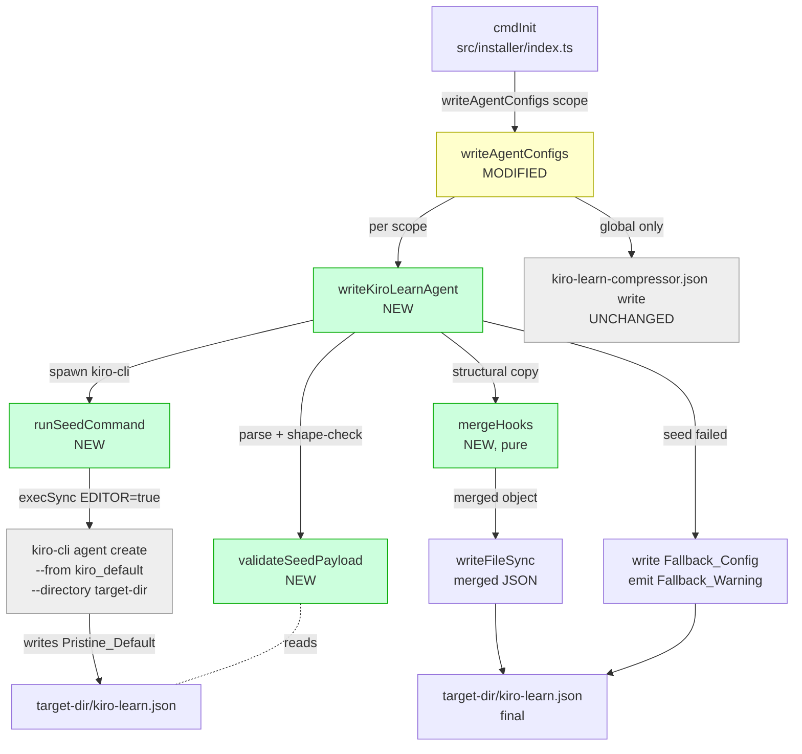
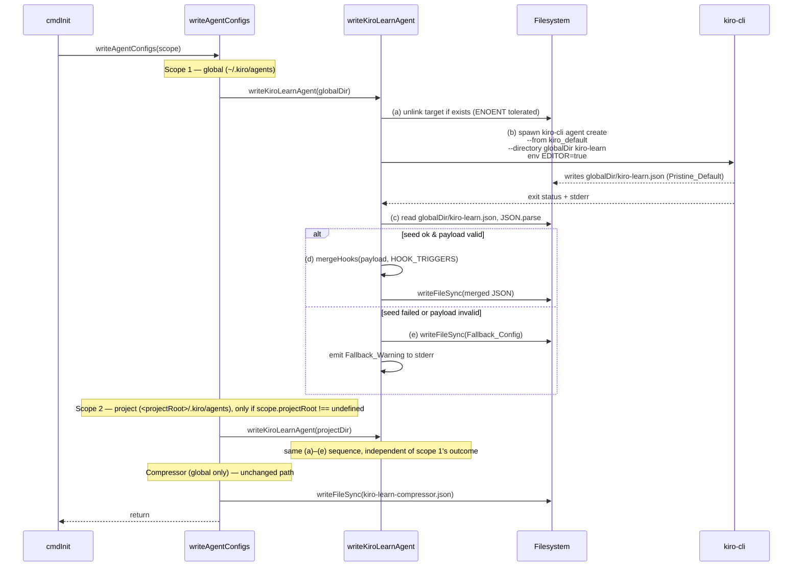

# Design Document: Default-Equivalent Agent

## Overview

This spec changes how the installer writes `kiro-learn.json`. Today `writeAgentConfigs` emits a hand-authored JSON document containing only `name`, `description`, and four hook triggers pointing at the shim — which silently regresses the user experience the moment `kiro-cli agent set-default kiro-learn` runs, because the installed agent has no tool list, no system prompt, and no MCP servers. The fix is to seed each `kiro-learn.json` from Kiro's built-in default agent using the `kiro-cli` CLI itself, then merge kiro-learn's four hooks onto the seed. We pick `kiro-cli agent create --from kiro_default --directory <target-dir> kiro-learn` as the seeding mechanism because `kiro_default`'s shape is owned by `kiro-cli` and evolves across releases — reusing whatever `kiro-cli` resolves at install time keeps kiro-learn in lockstep without a hardcoded snapshot in this repo. The only seam that changes is `writeAgentConfigs` in `src/installer/index.ts`; everything upstream (scope detection, layout creation, payload deploy) and everything downstream (`setDefaultAgent`, daemon start) is untouched. The compressor agent (Requirement 8) is explicitly out of scope and keeps its current hand-authored config.

**In scope:** seed-then-merge flow for `kiro-learn.json` at global scope (always) and project scope (when detected); fallback to the current minimal config when seeding fails; a clearly-worded stderr warning per scope on fallback.

**Out of scope:** `kiro-learn-compressor.json`; the timing of `kiro-cli agent set-default`; the shim path, hook command strings, or the four kiro-learn-owned triggers.

## Architecture

### Component Context



Green = new helpers in this spec. Yellow = modified. Grey = unchanged.

### Per-Scope Sequence

Requirement 12 makes the per-scope order observable, so the sequence is load-bearing for integration tests that assert intermediate states.



Two invariants fall out of this sequence:

1. **Per-scope atomicity of order.** Steps (a) through (d) or (a) through (e) complete for one scope before step (a) begins for the next scope (Requirement 12.2). The scopes do not interleave.
2. **Independent fallback.** A fallback in scope 1 does not short-circuit scope 2, and vice versa (Requirement 6.4).

### Modularity Boundary

| Module | May import from | Must NOT import from |
|--------|----------------|---------------------|
| `src/installer/index.ts` | `node:child_process`, `node:fs`, `node:os`, `node:path`, `src/types/` (types only, if needed) | `src/collector/`, `src/shim/` |

No new files. All four helpers live in `src/installer/index.ts` alongside the existing `writeAgentConfigs`, keeping the installer module self-contained and matching how the installer's other helpers (`createLayout`, `deployPayload`, `writeBinWrappers`) are organised.

## Components and Interfaces

### Helper 1: `runSeedCommand`

**Purpose.** Spawn `kiro-cli agent create --from kiro_default --directory <target-dir> kiro-learn` with `EDITOR=true` and report the outcome as a tagged union. No parsing, no validation — just "did `kiro-cli` successfully write a file at the expected path?"

**Interface.**

```typescript
/**
 * The result of invoking the Seed_Command for one Agent_Scope.
 * `ok: true` means kiro-cli exited zero AND the expected file exists on disk.
 */
export type SeedResult =
  | { ok: true; targetFile: string }
  | { ok: false; reason: 'spawn-failed' | 'non-zero-exit' | 'missing-file'; stderr: string };

/**
 * Invoke the Seed_Command for the given Agent_Scope's agents directory.
 *
 * Runs `EDITOR=true kiro-cli agent create --from kiro_default
 * --directory <targetDir> kiro-learn` synchronously via execSync with
 * stdio=['ignore','pipe','pipe'].
 *
 * @param targetDir Absolute path to the Seed_Target_Directory (the scope's
 *                  `.kiro/agents/` directory).
 * @returns A SeedResult describing whether the seed file was written.
 *
 * @see Requirements 1.1–1.7, 12.3
 */
export function runSeedCommand(targetDir: string): SeedResult;
```

**Responsibilities.**
- Compute `targetFile = path.join(targetDir, 'kiro-learn.json')`.
- Invoke `execSync('kiro-cli agent create --from kiro_default --directory <targetDir> kiro-learn', { env: { ...process.env, EDITOR: 'true' }, stdio: ['ignore','pipe','pipe'] })`.
- If `execSync` throws (ENOENT on `kiro-cli`, or non-zero exit): return `{ ok: false, reason: 'spawn-failed' | 'non-zero-exit', stderr }`. Distinguish the two by whether the thrown error has a numeric `status` property.
- If `execSync` returns normally but `existsSync(targetFile)` is false: return `{ ok: false, reason: 'missing-file', stderr: '' }`.
- Otherwise return `{ ok: true, targetFile }`.

**Non-responsibilities.** Does not parse the file. Does not delete anything (the delete happens before this helper is called, in `writeKiroLearnAgent`).

### Helper 2: `validateSeedPayload`

**Purpose.** Take the raw string contents of `<target-dir>/kiro-learn.json` and decide whether the Seed_Payload is usable. Pure function; no throwing.

**Interface.**

```typescript
/**
 * Validate the raw seed payload string per Requirement 3.
 *
 * Returns the parsed object on success. Returns null on any failure
 * (invalid JSON, null/undefined, non-object, empty object). Never throws.
 *
 * @see Requirements 3.1–3.5
 */
export function validateSeedPayload(raw: string): Record<string, unknown> | null;
```

**Responsibilities.**
- Attempt `JSON.parse(raw)`. On `SyntaxError` return `null`.
- If the parsed value is `null`, `undefined`, not of `typeof === 'object'`, an `Array.isArray` array, or has `Object.keys(value).length === 0`: return `null`.
- Otherwise return the parsed value typed as `Record<string, unknown>`.

**Non-responsibilities.** Does not assert the presence of any named field. Requirement 3.5 is explicit: `tools`, `prompt`, `description`, `mcpServers`, `allowedTools` are all optional in the Seed_Payload.

### Helper 3: `mergeHooks`

**Purpose.** Pure, side-effect-free function that takes a validated Seed_Payload plus the kiro-learn hook triggers and returns the merged object. This is the one helper that is trivial to unit-test and is the natural target for property-based tests — every property in the Correctness Properties section anchors here.

**Interface.**

```typescript
/**
 * The four hook triggers kiro-learn owns. Exactly these keys, no others.
 * Each value is the hook entry array that will replace whatever the Seed_Payload
 * had at that trigger.
 *
 * @see Requirements 4.3, 4.6, Installer_Hook_Triggers glossary
 */
export interface HookTriggerMap {
  agentSpawn: readonly HookEntry[];
  userPromptSubmit: readonly HookEntry[];
  postToolUse: readonly HookEntry[];
  stop: readonly HookEntry[];
}

/** A single hook entry as it appears in the agent JSON. */
export interface HookEntry {
  /** Shell command string, e.g. `"<shim>" || true`. */
  command: string;
  /** Optional matcher for triggers like postToolUse. */
  matcher?: string;
}

/**
 * Merge kiro-learn's four hook triggers onto a validated Seed_Payload.
 *
 * Rules (Requirement 4):
 *  - name          → 'kiro-learn' (overwritten).
 *  - description   → kiro-learn's description (overwritten).
 *  - hooks.<t>     → triggers[t] for t in Installer_Hook_Triggers (overwritten).
 *  - hooks.<other> → preserved unchanged for t NOT in Installer_Hook_Triggers.
 *  - all other top-level keys → copied through unchanged.
 *
 * Pure: returns a fresh object, never mutates `seed`.
 *
 * @see Requirements 4.1–4.7
 */
export function mergeHooks(
  seed: Record<string, unknown>,
  triggers: HookTriggerMap,
): Record<string, unknown>;
```

**Responsibilities.**
- Start from a shallow copy of `seed`.
- Overwrite `name` with the string literal `'kiro-learn'`.
- Overwrite `description` with the kiro-learn description string (a module-level constant; same string the current code uses).
- Compute `mergedHooks` by starting from whatever `seed.hooks` was (treated as `{}` if absent or not an object), then for each `t` in `['agentSpawn', 'userPromptSubmit', 'postToolUse', 'stop']`, setting `mergedHooks[t] = [...triggers[t]]` (fresh array — no aliasing with the input).
- Set the result's `hooks` to `mergedHooks`.
- Return the result.

**Non-responsibilities.** Does no I/O, no logging, no validation. If `seed.hooks` is something bizarre like a string or array, the function coerces it to `{}` rather than throwing — this is a design-by-contract decision: `validateSeedPayload` already guaranteed `seed` is a non-empty object, but `seed.hooks` specifically was never constrained.

### Helper 4: `writeKiroLearnAgent`

**Purpose.** Per-scope orchestrator that executes the five-step sequence from Requirement 12.1: delete → seed → validate → (merge-and-write | fallback-and-warn). This is the only helper with side effects at the filesystem level; the three above are either pure (`validateSeedPayload`, `mergeHooks`) or encapsulate a single process spawn (`runSeedCommand`).

**Interface.**

```typescript
/**
 * Write the kiro-learn.json agent config at the given Agent_Scope's
 * `.kiro/agents/` directory, using the seed-then-merge flow from
 * Requirements 2, 3, 4, 5, 6, and 12.
 *
 * @param targetDir Absolute path to the scope's `.kiro/agents/` directory.
 *                  Caller (`createLayout`) has already ensured this exists.
 *
 * @see Requirements 2.1–2.4, 3.1–3.5, 4.1–4.7, 5.1–5.3, 6.1–6.5, 12.1
 */
export function writeKiroLearnAgent(targetDir: string): void;
```

**Responsibilities.**
- (a) `unlink(<targetDir>/kiro-learn.json)` — tolerate `ENOENT` (file may not exist), propagate any other error.
- (b) Call `runSeedCommand(targetDir)`.
- (c) On `SeedResult.ok === true`: read the file, call `validateSeedPayload`.
- (d) On valid payload: call `mergeHooks(payload, KIRO_LEARN_TRIGGERS)`, `JSON.stringify(merged, null, 2) + '\n'`, `writeFileSync` to `targetFile`.
- (e) On any failure (`SeedResult.ok === false` or `validateSeedPayload` returned `null`): call an inner `writeFallback(targetDir)` that writes the Fallback_Config and emits a single Fallback_Warning to stderr per Requirement 11.

**Non-responsibilities.** Does not decide which scopes to write — that's `writeAgentConfigs`'s job. Does not invoke `kiro-cli agent set-default` — that's `cmdInit`'s job.

### Hookup: Modified `writeAgentConfigs`

**Purpose.** Unchanged signature, unchanged behaviour for the compressor agent. The only change is that the inline kiro-learn config construction and write is replaced by two calls to `writeKiroLearnAgent` (one per applicable scope).

**Signature (unchanged).**

```typescript
/**
 * Generate and write both agent config files at all applicable scopes.
 *
 * - kiro-learn.json: global always, project-scoped when detected.
 *   Seeded from `kiro_default` via `kiro-cli agent create`, then
 *   kiro-learn's four hook triggers are merged on top. Falls back to a
 *   minimal hooks-only config if seeding fails.
 * - kiro-learn-compressor.json: global only, hand-authored (unchanged).
 *
 * @see Requirements 1–12
 */
export function writeAgentConfigs(scope: InstallScope): void;
```

**Behaviour after modification.**
- Global kiro-learn: `writeKiroLearnAgent(path.join(homedir(), '.kiro', 'agents'))`.
- Project kiro-learn (iff `scope.projectRoot !== undefined`): `writeKiroLearnAgent(path.join(scope.projectRoot, '.kiro', 'agents'))`.
- Compressor: existing `writeFileSync` of the hand-authored compressor config to the global agents dir — *byte-for-byte unchanged* per Requirement 8.

## Data Models

### `HookTriggerMap` — the four kiro-learn hook triggers

```typescript
// Module-level constant in src/installer/index.ts.
// Built once per writeAgentConfigs call from the shim path.

const KIRO_LEARN_TRIGGERS: HookTriggerMap = {
  agentSpawn:       [{ command: `"${shimPath}" || true` }],
  userPromptSubmit: [{ command: `"${shimPath}" || true` }],
  postToolUse:      [{ matcher: '*', command: `"${shimPath}" || true` }],
  stop:             [{ command: `"${shimPath}" || true` }],
};
```

- `shimPath` is `path.join(INSTALL_DIR, 'bin', 'shim')` — same value the current code uses.
- The `" || true"` suffix and the double-quoting around `shimPath` are *exactly* what `writeAgentConfigs` emits today. Do not touch these.
- `postToolUse` carries `matcher: '*'`; the other three do not. This matches the current hand-authored shape and what kiro-cli expects.

### `SeedResult` — the outcome of `runSeedCommand`

```typescript
type SeedResult =
  | { ok: true;  targetFile: string }
  | { ok: false; reason: 'spawn-failed' | 'non-zero-exit' | 'missing-file'; stderr: string };
```

- `spawn-failed`: `execSync` threw an error with no numeric `status` property. Covers ENOENT (kiro-cli not on PATH) and similar OS-level spawn failures.
- `non-zero-exit`: `execSync` threw an error with a numeric `status` property set. Covers kiro-cli running but rejecting the command (unknown flag, `kiro_default` not resolvable, permission denied, etc.).
- `missing-file`: `execSync` returned successfully (exit 0) but `existsSync(targetFile)` is false. A defensive check — kiro-cli should always produce the file on zero exit, but we don't want to crash if it ever doesn't.
- `stderr` is captured verbatim from the `execSync` error (or empty string for the `missing-file` case) so `writeKiroLearnAgent` can include it in the Fallback_Warning if we ever want to.

### `Fallback_Config` — the minimal hooks-only shape

Written verbatim when seeding fails. Structurally identical to what `writeAgentConfigs` writes *today* before this spec lands — preserving byte-for-byte compatibility is explicit in Correctness Property P4 and Requirement 6.2.

```typescript
interface FallbackConfig {
  name: 'kiro-learn';
  description: string; // KIRO_LEARN_DESCRIPTION constant
  hooks: {
    agentSpawn:       [{ command: string }];
    userPromptSubmit: [{ command: string }];
    postToolUse:      [{ matcher: '*'; command: string }];
    stop:             [{ command: string }];
  };
}

// Written as: JSON.stringify(fallback, null, 2) + '\n'
// with key order: name, description, hooks (top-level),
// and agentSpawn, userPromptSubmit, postToolUse, stop (inside hooks).
```

The description string is:

```
"Continuous learning for Kiro sessions. Captures tool-use events and injects prior context."
```

Extracted as `KIRO_LEARN_DESCRIPTION` once at module level; both `mergeHooks` (via its `description` overwrite) and the fallback writer read from the same constant.

### Observable filesystem states per scope

| Step | `<targetDir>/kiro-learn.json` contents |
|------|----------------------------------------|
| Before `writeKiroLearnAgent` | absent, or leftover from prior run |
| After (a) unlink | absent |
| After (b) seed success | Pristine_Default written by kiro-cli |
| After (d) merge write | merged JSON (Seed_Payload fields ∪ kiro-learn name/description/four-hook overwrite) |
| After (e) fallback write (seed failed) | Fallback_Config JSON |

Exactly one of (d) or (e) occurs per `writeKiroLearnAgent` invocation. The post-state is always a present, valid JSON file at `<targetDir>/kiro-learn.json` — Requirement 6.5 says a seed failure is not an install failure.


## Algorithmic Pseudocode

### `runSeedCommand`

```typescript
function runSeedCommand(targetDir: string): SeedResult {
  const targetFile = path.join(targetDir, 'kiro-learn.json');
  const cmd = `kiro-cli agent create --from kiro_default --directory ${shellQuote(targetDir)} kiro-learn`;

  try {
    execSync(cmd, {
      env: { ...process.env, EDITOR: 'true' },
      stdio: ['ignore', 'pipe', 'pipe'],
    });
  } catch (err: unknown) {
    const e = err as { status?: number; stderr?: Buffer | string };
    const stderr =
      typeof e.stderr === 'string' ? e.stderr :
      Buffer.isBuffer(e.stderr)    ? e.stderr.toString('utf8') : '';

    // Differentiate spawn-failed (no status) from non-zero-exit (numeric status).
    return typeof e.status === 'number'
      ? { ok: false, reason: 'non-zero-exit', stderr }
      : { ok: false, reason: 'spawn-failed',  stderr };
  }

  // Defensive: even on exit 0, confirm the file exists.
  if (!existsSync(targetFile)) {
    return { ok: false, reason: 'missing-file', stderr: '' };
  }
  return { ok: true, targetFile };
}
```

**Preconditions.** `targetDir` is an absolute path to an existing, writable directory. The caller has already deleted `targetDir/kiro-learn.json` if it existed.

**Postconditions.**
- On `ok: true`: `<targetDir>/kiro-learn.json` exists on disk. Its contents have not been read or validated.
- On any `ok: false` variant: the caller is responsible for writing the Fallback_Config. No child process is left running — `execSync` is synchronous by definition.

### `validateSeedPayload`

```typescript
function validateSeedPayload(raw: string): Record<string, unknown> | null {
  let parsed: unknown;
  try {
    parsed = JSON.parse(raw);
  } catch {
    return null;
  }

  if (parsed === null || parsed === undefined)          return null;
  if (typeof parsed !== 'object')                       return null;
  if (Array.isArray(parsed))                            return null;
  if (Object.keys(parsed as object).length === 0)       return null;

  return parsed as Record<string, unknown>;
}
```

**Preconditions.** `raw` is any string — may be empty, invalid JSON, or valid JSON of any shape.

**Postconditions.** Never throws. Returns `null` iff the input is not a JSON-encoded non-empty plain (non-array) object. Otherwise returns the parsed value typed as `Record<string, unknown>`.

### `mergeHooks`

```typescript
const OWNED_TRIGGERS = ['agentSpawn', 'userPromptSubmit', 'postToolUse', 'stop'] as const;

function mergeHooks(
  seed: Record<string, unknown>,
  triggers: HookTriggerMap,
): Record<string, unknown> {
  // Start from a shallow copy of all top-level keys — preserves tools, prompt,
  // mcpServers, allowedTools, and any other fields kiro_default ships now or
  // in the future (Requirement 4.7).
  const merged: Record<string, unknown> = { ...seed };

  // Overwrite the three fields kiro-learn owns at the top level.
  merged['name'] = 'kiro-learn';
  merged['description'] = KIRO_LEARN_DESCRIPTION;

  // Start hooks from whatever the seed had. Coerce to {} if absent or malformed.
  const seedHooks = seed['hooks'];
  const baseHooks: Record<string, unknown> =
    seedHooks !== null && typeof seedHooks === 'object' && !Array.isArray(seedHooks)
      ? { ...(seedHooks as Record<string, unknown>) }
      : {};

  // Overwrite the four owned triggers — produces fresh arrays, no aliasing.
  for (const t of OWNED_TRIGGERS) {
    baseHooks[t] = [...triggers[t]];
  }
  merged['hooks'] = baseHooks;

  return merged;
}
```

**Preconditions.** `seed` is a non-empty plain object (output of `validateSeedPayload`). `triggers` has exactly the four keys `agentSpawn`, `userPromptSubmit`, `postToolUse`, `stop`, each bound to a `HookEntry[]`.

**Postconditions.**
- `merged.name === 'kiro-learn'`.
- `merged.description === KIRO_LEARN_DESCRIPTION`.
- For every `t` in `OWNED_TRIGGERS`: `merged.hooks[t]` deep-equals `triggers[t]`.
- For every hook trigger `u` in `seed.hooks` with `u ∉ OWNED_TRIGGERS`: `merged.hooks[u]` is referentially equal to `seed.hooks[u]` (shallow copy through the spread).
- For every top-level key `k` in `seed` with `k ∉ {name, description, hooks}`: `merged[k]` is referentially equal to `seed[k]`.
- `seed` itself is not mutated.

**Loop invariant (the `for` over `OWNED_TRIGGERS`).** After iteration `i`, `baseHooks[OWNED_TRIGGERS[j]]` equals `triggers[OWNED_TRIGGERS[j]]` for all `j <= i`, and all other keys of `baseHooks` are as they were at loop entry.

### `writeKiroLearnAgent`

```typescript
function writeKiroLearnAgent(targetDir: string): void {
  const targetFile = path.join(targetDir, 'kiro-learn.json');

  // (a) Delete existing file if present (Requirements 2.1–2.2).
  try {
    unlinkSync(targetFile);
  } catch (err: unknown) {
    const e = err as NodeJS.ErrnoException;
    if (e.code !== 'ENOENT') throw err; // other errors propagate
  }

  // (b) Invoke the Seed_Command.
  const seed = runSeedCommand(targetDir);

  if (!seed.ok) {
    writeFallback(targetFile, scopeLabel(targetDir), reasonToCause(seed.reason));
    return;
  }

  // (c) Read and validate.
  const raw = readFileSync(seed.targetFile, 'utf8');
  const payload = validateSeedPayload(raw);

  if (payload === null) {
    writeFallback(targetFile, scopeLabel(targetDir), 'seed command failed');
    return;
  }

  // (d) Merge and write.
  const merged = mergeHooks(payload, KIRO_LEARN_TRIGGERS);
  writeFileSync(targetFile, JSON.stringify(merged, null, 2) + '\n');
}

function writeFallback(targetFile: string, scopeLabel: string, cause: string): void {
  const fallback: FallbackConfig = {
    name: 'kiro-learn',
    description: KIRO_LEARN_DESCRIPTION,
    hooks: {
      agentSpawn:       [{ command: `"${shimPath}" || true` }],
      userPromptSubmit: [{ command: `"${shimPath}" || true` }],
      postToolUse:      [{ matcher: '*', command: `"${shimPath}" || true` }],
      stop:             [{ command: `"${shimPath}" || true` }],
    },
  };
  writeFileSync(targetFile, JSON.stringify(fallback, null, 2) + '\n');

  process.stderr.write(
    `[kiro-learn] warning: could not seed kiro-learn agent from kiro_default ` +
    `(${cause}) for ${scopeLabel} scope. Writing minimal hooks-only config — ` +
    `the agent will not have the default tools, prompt, or MCP servers until ` +
    `you install/upgrade kiro-cli and rerun 'kiro-learn init'.\n`,
  );
}
```

**Preconditions.** `targetDir` exists and is writable. `KIRO_LEARN_TRIGGERS` and `shimPath` are defined at module scope.

**Postconditions.**
- Exactly one of the merged-write or fallback-write branches executes.
- `<targetDir>/kiro-learn.json` exists after return in both branches.
- The fallback branch emits exactly one `process.stderr.write` call; the success branch emits none.
- Never throws on seed failure — a seed failure is not an install failure (Requirement 6.5).
- Throws only on unexpected errors: non-ENOENT unlink errors, readFileSync errors on a file that `runSeedCommand` said exists, or writeFileSync errors (permission denied on the agents dir).

### `writeAgentConfigs` (updated orchestrator)

```typescript
export function writeAgentConfigs(scope: InstallScope): void {
  // Scope 1: global kiro-learn agent — always written.
  writeKiroLearnAgent(path.join(homedir(), '.kiro', 'agents'));

  // Scope 2: project kiro-learn agent — only when a project was detected.
  if (scope.projectRoot !== undefined) {
    writeKiroLearnAgent(path.join(scope.projectRoot, '.kiro', 'agents'));
  }

  // Compressor agent — global only, hand-authored (Requirement 8). UNCHANGED.
  const compressorConfig = { /* existing inline construction, untouched */ };
  writeFileSync(
    path.join(homedir(), '.kiro', 'agents', 'kiro-learn-compressor.json'),
    JSON.stringify(compressorConfig, null, 2) + '\n',
  );
}
```

**Preconditions.** `scope` produced by `detectScope`. The agents directories for every scope being written have been created by `createLayout`.

**Postconditions.**
- Global `~/.kiro/agents/kiro-learn.json` exists (merged or fallback).
- Global `~/.kiro/agents/kiro-learn-compressor.json` exists with today's bytes.
- If `scope.projectRoot !== undefined`: `<projectRoot>/.kiro/agents/kiro-learn.json` exists (merged or fallback).
- No other file in any agents dir has been created or deleted.
- Scope 2's steps do not begin until scope 1's steps have all completed (Requirement 12.2).

## Key Functions with Formal Specifications

### `runSeedCommand(targetDir: string): SeedResult`

**Preconditions.**
- `targetDir` is an absolute path.
- `targetDir` exists and is writable.
- Any pre-existing `<targetDir>/kiro-learn.json` has already been removed by the caller.

**Postconditions.**
- Returns `{ ok: true, targetFile }` iff `kiro-cli agent create --from kiro_default --directory <targetDir> kiro-learn` exited 0 AND `existsSync(<targetDir>/kiro-learn.json)`.
- Returns `{ ok: false, reason: 'spawn-failed', stderr }` iff `execSync` threw an error with no numeric `status` (OS-level spawn failure, e.g. ENOENT on `kiro-cli`).
- Returns `{ ok: false, reason: 'non-zero-exit', stderr }` iff `execSync` threw an error with a numeric `status` set.
- Returns `{ ok: false, reason: 'missing-file', stderr: '' }` iff `execSync` returned normally but the file is absent.
- The process environment passed to `execSync` has `EDITOR = 'true'` and preserves all other keys from `process.env`.
- Never leaks a child process (guaranteed by synchronous `execSync` semantics).

### `validateSeedPayload(raw: string): Record<string, unknown> | null`

**Preconditions.** `raw` is any string.

**Postconditions.**
- Never throws.
- Returns `null` iff any of the following hold: `JSON.parse(raw)` throws; the parsed value is `null`, `undefined`, a primitive, an array, or an object with `Object.keys(…).length === 0`.
- Otherwise returns the parsed value typed as `Record<string, unknown>`.

### `mergeHooks(seed, triggers): Record<string, unknown>`

**Preconditions.**
- `seed` is a non-empty plain object (as produced by `validateSeedPayload`).
- `triggers` has exactly the four keys `agentSpawn`, `userPromptSubmit`, `postToolUse`, `stop`.

**Postconditions.**
- `merged.name === 'kiro-learn'`.
- `merged.description === KIRO_LEARN_DESCRIPTION`.
- For each `t ∈ OWNED_TRIGGERS`: `merged.hooks[t]` deep-equals `triggers[t]`.
- For each key `u` in `seed.hooks` (if present) with `u ∉ OWNED_TRIGGERS`: `merged.hooks[u]` equals `seed.hooks[u]`.
- For each top-level key `k` in `seed` with `k ∉ {name, description, hooks}`: `merged[k]` equals `seed[k]`.
- `seed` is not mutated.
- Pure: `mergeHooks(s, t)` called twice with the same inputs produces deep-equal outputs and performs no side effects.

### `writeKiroLearnAgent(targetDir: string): void`

**Preconditions.** `targetDir` exists and is writable.

**Postconditions.**
- After return, `<targetDir>/kiro-learn.json` exists and is either the merged JSON (seed + validation both succeeded) or the Fallback_Config JSON (either step failed).
- The fallback branch executed iff `runSeedCommand` returned `{ ok: false, … }` OR `validateSeedPayload` returned `null`.
- In the fallback branch, exactly one `process.stderr.write` call was made with a string starting with `[kiro-learn] warning:`.
- In the success branch, zero `process.stderr.write` calls were made from within this helper.
- The sequence of observable filesystem operations is: `unlink` (or ENOENT-swallowed no-op) → `execSync` → (on success: `readFileSync` → `writeFileSync`) or (on failure: `writeFileSync`).

### `writeAgentConfigs(scope: InstallScope): void`

**Preconditions.** `createLayout(scope)` has been called so all required agents dirs exist.

**Postconditions.**
- Global `~/.kiro/agents/kiro-learn.json` exists with either merged or fallback bytes.
- Global `~/.kiro/agents/kiro-learn-compressor.json` exists with bytes identical to what the pre-spec installer wrote (Requirement 8.2).
- `<projectRoot>/.kiro/agents/kiro-learn.json` exists iff `scope.projectRoot !== undefined`, with either merged or fallback bytes.
- `<projectRoot>/.kiro/agents/kiro-learn-compressor.json` is never written (Requirement 8.3).
- All operations for the global scope complete before any operation for the project scope begins (Requirement 12.2).

## Example Usage

### Happy path (seed succeeds, merge applied)

```typescript
// Mocked seed payload returned by kiro-cli agent create --from kiro_default.
// In a real run this would be written by kiro-cli; here we simulate the file
// it leaves on disk just before writeKiroLearnAgent reads it.
const mockSeed = {
  name: 'kiro_default',
  description: 'Default Kiro CLI agent',
  prompt: 'You are a helpful AI assistant...',
  tools: ['fs_read', 'fs_write', 'execute_bash'],
  allowedTools: ['fs_read', 'execute_bash'],
  mcpServers: { example: { command: 'npx', args: ['example-mcp'] } },
  hooks: {
    // A hypothetical non-owned trigger in kiro_default:
    preToolUse: [{ matcher: '*', command: '/usr/local/bin/guard' }],
  },
};

// After writeKiroLearnAgent runs successfully, the file contains:
{
  name: 'kiro-learn',                                    // overwritten (Req 4.1)
  description: 'Continuous learning for Kiro sessions…', // overwritten (Req 4.2)
  prompt: 'You are a helpful AI assistant...',           // preserved  (Req 4.7)
  tools: ['fs_read', 'fs_write', 'execute_bash'],        // preserved  (Req 4.7)
  allowedTools: ['fs_read', 'execute_bash'],             // preserved  (Req 4.7)
  mcpServers: { example: { command: 'npx', args: ['example-mcp'] } }, // preserved
  hooks: {
    preToolUse: [{ matcher: '*', command: '/usr/local/bin/guard' }],  // preserved (Req 4.4)
    agentSpawn:       [{ command: '"<shim>" || true' }],              // owned  (Req 4.3)
    userPromptSubmit: [{ command: '"<shim>" || true' }],              // owned
    postToolUse:      [{ matcher: '*', command: '"<shim>" || true' }],// owned
    stop:             [{ command: '"<shim>" || true' }],              // owned
  },
}
```

### Fallback path (kiro-cli unavailable)

```typescript
// runSeedCommand returns { ok: false, reason: 'spawn-failed', stderr: '…' }
// because execSync threw ENOENT.

// writeKiroLearnAgent then writes the Fallback_Config and emits one warning:
// stderr:
//   [kiro-learn] warning: could not seed kiro-learn agent from kiro_default
//   (kiro-cli unavailable) for global scope. Writing minimal hooks-only
//   config — the agent will not have the default tools, prompt, or MCP
//   servers until you install/upgrade kiro-cli and rerun 'kiro-learn init'.

// <targetDir>/kiro-learn.json contents:
{
  name: 'kiro-learn',
  description: 'Continuous learning for Kiro sessions. Captures tool-use events and injects prior context.',
  hooks: {
    agentSpawn:       [{ command: '"<shim>" || true' }],
    userPromptSubmit: [{ command: '"<shim>" || true' }],
    postToolUse:      [{ matcher: '*', command: '"<shim>" || true' }],
    stop:             [{ command: '"<shim>" || true' }],
  },
}
// These are exactly the bytes the current hand-authored writer produces today.
// cmdInit still returns 0 (Requirement 6.5).
```

## Correctness Properties

*A property is a characteristic or behavior that should hold true across all valid executions of a system — essentially, a formal statement about what the software should do. Properties serve as the bridge between human-readable specifications and machine-verifiable correctness guarantees.*

The six properties below were derived from the prework analysis. Most acceptance criteria reduce to example-based tests (specific argv, specific stderr content, specific ordering of two operations). The properties below capture the universal contracts — the invariants that must hold across all valid inputs, not just representative examples.

### Property 1: `validateSeedPayload` contract

*For any* string `raw`, `validateSeedPayload(raw)` returns `null` if and only if `raw` is not a JSON encoding of a non-empty plain (non-array) object. When it returns non-null, the returned value deep-equals `JSON.parse(raw)`. The function never throws.

**Validates: Requirements 3.1, 3.2, 3.3, 3.4, 3.5**

### Property 2: `mergeHooks` overwrites owned fields with constants

*For any* validated seed payload `seed` and *for any* `HookTriggerMap triggers`, `mergeHooks(seed, triggers)` produces an object whose `name === 'kiro-learn'`, whose `description === KIRO_LEARN_DESCRIPTION`, and whose `hooks[t]` deep-equals `triggers[t]` for every `t` in `{agentSpawn, userPromptSubmit, postToolUse, stop}`. This holds regardless of what values `seed` had at those keys (including absent).

**Validates: Requirements 4.1, 4.2, 4.3, 4.5, 4.6**

### Property 3: `mergeHooks` preserves non-owned fields

*For any* validated seed payload `seed` and *for any* `HookTriggerMap triggers`: for every top-level key `k` in `seed` with `k ∉ {name, description, hooks}`, `mergeHooks(seed, triggers)[k]` deep-equals `seed[k]`; and for every hook trigger `u` present in `seed.hooks` with `u ∉ {agentSpawn, userPromptSubmit, postToolUse, stop}`, `mergeHooks(seed, triggers).hooks[u]` deep-equals `seed.hooks[u]`.

**Validates: Requirements 4.4, 4.7, 3.5**

### Property 4: `mergeHooks` is deterministic and pure

*For any* `seed` and `triggers`, two successive calls `mergeHooks(seed, triggers)` produce deep-equal return values, and `seed` is byte-for-byte identical before and after each call (no mutation). Consequently, `JSON.stringify(mergeHooks(seed, triggers), null, 2)` is stable across invocations with the same inputs.

**Validates: Requirement 7.3**

### Property 5: Fallback output matches the current bare config byte-for-byte

*For any* invocation of `writeKiroLearnAgent` where `runSeedCommand` returns `{ ok: false, … }` or `validateSeedPayload` returns `null`, the bytes written to `<targetDir>/kiro-learn.json` equal `JSON.stringify(FALLBACK_CONFIG, null, 2) + '\n'`, where `FALLBACK_CONFIG` is structurally identical to the `kiro-learn.json` document the pre-spec `writeAgentConfigs` wrote at the same path. The fallback is byte-for-byte unchanged from today's behaviour so rollback to the bare config is observable without drift.

**Validates: Requirements 6.1, 6.2**

### Property 6: Per-scope ordering holds and scopes do not interleave

*For any* pair of scope outcomes (`scope1_result`, `scope2_result`) where each result is one of `seed-success`, `spawn-failed`, `non-zero-exit`, `missing-file`, `invalid-payload`, the recorded trace of observable operations from `writeAgentConfigs` equals the ordered concatenation `trace(scope1) ++ trace(scope2_if_projectRoot_defined) ++ trace(compressor_write)`, where each per-scope trace matches either `[unlink, execSync, readFileSync, writeFileSync]` (success branch) or `[unlink, execSync, writeFileSync, stderrWrite]` (failure branch). No operation for scope 2 appears in the trace before the last operation for scope 1.

**Validates: Requirements 6.4, 9.3, 12.1, 12.2**

## Error Handling

### Error: `kiro-cli` not on PATH

**Condition.** `execSync` throws an error with no numeric `status` (typically ENOENT).
**Detection.** `runSeedCommand` catches the throw, sees `status === undefined`, returns `{ ok: false, reason: 'spawn-failed', stderr }`.
**Response.** `writeKiroLearnAgent` writes the Fallback_Config, emits the Fallback_Warning to stderr, and returns normally. `cmdInit` continues with `set-default` and daemon start, returns exit code 0.
**Recovery.** User installs `kiro-cli`, re-runs `kiro-learn init`. The next run retries the seed and writes a merged config on success.

### Error: `kiro-cli` present but rejects the command

**Condition.** `execSync` throws with a numeric `status` (e.g. unknown flag, `kiro_default` not resolvable on this kiro-cli version, insufficient permissions).
**Detection.** `runSeedCommand` catches the throw, sees `typeof status === 'number'`, returns `{ ok: false, reason: 'non-zero-exit', stderr }`.
**Response.** Same as above — Fallback_Config written, warning emitted, `cmdInit` continues.
**Recovery.** User upgrades `kiro-cli` to a version supporting `agent create --from kiro_default` (kiro-cli 2.x+), or checks directory permissions.

### Error: Zero exit but no file written

**Condition.** `execSync` returns normally but `existsSync(targetFile)` is false. Should not happen with a well-behaved `kiro-cli`; included as a defensive check.
**Detection.** `runSeedCommand` returns `{ ok: false, reason: 'missing-file', stderr: '' }`.
**Response.** Fallback path, same as above.
**Recovery.** Indicates a `kiro-cli` bug; user reports it upstream. The warning names the recovery as "install or upgrade kiro-cli".

### Error: Seed file exists but `JSON.parse` throws

**Condition.** `readFileSync` returns bytes that are not valid JSON (incomplete write, truncation, corruption).
**Detection.** `validateSeedPayload` catches the `SyntaxError` and returns `null`.
**Response.** Fallback path, same as above.
**Recovery.** Re-running init re-executes the full flow (pre-seed delete + fresh spawn), which in practice resolves transient filesystem corruption.

### Error: Seed file parses to null / primitive / array / empty object

**Condition.** `JSON.parse` succeeds but the parsed value is not a non-empty plain object.
**Detection.** `validateSeedPayload` catches the shape mismatch via the `typeof` / `Array.isArray` / `Object.keys` checks and returns `null`.
**Response.** Fallback path, same as above.
**Recovery.** User upgrades `kiro-cli` to a version that emits the expected shape.

### Error: Unlink fails because the file was already gone

**Condition.** `unlinkSync` throws with `code === 'ENOENT'` because no prior install left a file at the path.
**Detection.** The ENOENT catch in `writeKiroLearnAgent`'s step (a).
**Response.** Swallowed; flow continues to step (b). Requirement 2.2 explicitly allows this path.
**Recovery.** None needed.

### Error: Unlink fails for a non-ENOENT reason

**Condition.** `unlinkSync` throws with a different code (EACCES on a read-only directory, EPERM on a file with immutable bits).
**Detection.** The `if (e.code !== 'ENOENT') throw err` guard re-raises.
**Response.** The error propagates out of `writeKiroLearnAgent`, up through `writeAgentConfigs`, into the outer `try`/`catch` in `cmdInit`, which logs `[kiro-learn] init failed: <message>` and returns exit code 1.
**Recovery.** User fixes directory permissions on `~/.kiro/agents/` (or the project equivalent) and re-runs init.

### Error: `writeFileSync` fails on the merged or fallback write

**Condition.** Disk full, permission denied, file locked by another process.
**Detection.** `writeFileSync` throws.
**Response.** Propagates up through `writeAgentConfigs` → `cmdInit`, which logs the error and returns exit code 1. Unlike seed failures, a write-phase failure is a real install failure: the scope's agent file is in an indeterminate state and we don't want to silently paper over it with the fallback.
**Recovery.** User resolves the underlying fs issue and re-runs init.

## Testing Strategy

### Unit Testing Approach

Existing installer tests live under `test/unit/` with a clear naming pattern (`installer-*.test.ts`). The new helpers slot into the same pattern.

- **`runSeedCommand`** — mock `execSync` (vi.mock on `node:child_process`) and mock `existsSync` (vi.mock on `node:fs`). Test matrix: (i) happy path — execSync returns normally, file exists → `ok: true`; (ii) execSync throws with no `status` → `spawn-failed`; (iii) execSync throws with `status: 1` → `non-zero-exit`; (iv) execSync returns but `existsSync` is false → `missing-file`. Assert argv string contains `--from kiro_default`, `--directory <targetDir>`, positional `kiro-learn`. Assert `env.EDITOR === 'true'` and other process.env entries are preserved.
- **`validateSeedPayload`** — table-driven tests over representative inputs: `""`, `"not json"`, `"null"`, `"true"`, `"42"`, `"[]"`, `"[1,2]"`, `"{}"`, `"{\"a\":1}"`. See also the property test below for P1.
- **`mergeHooks`** — table-driven tests covering the four requirement clauses (4.1–4.4 and 4.7 via concrete fixtures) plus the property-based tests below for P2–P4.
- **`writeKiroLearnAgent`** — use a tmp dir as `targetDir` and mock `execSync` to simulate both seed-success and each of the three seed-failure modes. Drive the file-write side with the real `fs` module against the tmp dir. Assert final file contents in each branch and stderr content in the fallback branch.
- **`writeAgentConfigs` (integration with the helpers)** — tmp-dir-scoped test with a mocked home dir (via monkey-patched `os.homedir`) and a mocked `InstallScope`. Verify both global-only and global+project scopes produce the expected files.

All existing installer tests that currently assert on the bare `kiro-learn.json` bytes need to be updated — either by adjusting the expected bytes to the merged shape (preferred) or by mocking `runSeedCommand` to force the fallback branch and asserting today's bytes. Tests covering `kiro-learn-compressor.json` must stay unchanged (guarding Requirement 8).

### Property-Based Testing Approach

Property test library: **fast-check** (already in devDependencies; used by the existing `installer-*.property.test.ts` files).

Each property test runs ≥ 100 iterations and is tagged:

```typescript
// Feature: default-equivalent-agent, Property 1: validateSeedPayload contract
// Feature: default-equivalent-agent, Property 2: mergeHooks overwrites owned fields with constants
// Feature: default-equivalent-agent, Property 3: mergeHooks preserves non-owned fields
// Feature: default-equivalent-agent, Property 4: mergeHooks is deterministic and pure
// Feature: default-equivalent-agent, Property 5: Fallback output matches current bare config byte-for-byte
// Feature: default-equivalent-agent, Property 6: Per-scope ordering holds and scopes do not interleave
```

- **P1 (`validateSeedPayload`).** Generate `fc.anything()` values, `JSON.stringify` them, and feed into `validateSeedPayload`. Assert the return is non-null iff the generated value is a non-empty plain object. Separately, feed `fc.string()` and assert that for strings where `JSON.parse` throws, the return is null.
- **P2 (owned-field overwrite).** Use an arbitrary that generates `Record<string, unknown>` objects with a mix of keys including random values at `name`, `description`, and `hooks.{owned}`. Generate arbitrary `HookTriggerMap` instances (fast-check `fc.record` over the four keys, each bound to an array of arbitrary `{command, matcher?}` records). Assert the three overwrite invariants.
- **P3 (non-owned preservation).** Same generator as P2, but additionally generate top-level keys outside `{name, description, hooks}` and trigger names outside the four owned ones. Assert those values survive unchanged.
- **P4 (determinism).** Call `mergeHooks` twice on the same inputs and assert deep equality of the outputs plus identity of the input (serialised before/after the calls).
- **P5 (fallback bytes).** No random input needed beyond the set of seed-failure reasons. Parameterise over `{'spawn-failed', 'non-zero-exit', 'missing-file', 'invalid-payload'}`, drive the fallback branch, and assert the written bytes equal a golden constant extracted from the pre-spec `writeAgentConfigs` source.
- **P6 (ordering trace).** Instrument `unlinkSync`, `execSync`, `readFileSync`, `writeFileSync`, and `process.stderr.write` with a shared recorder. Generate `(scope1_outcome, scope2_outcome)` pairs from the product of `{success, spawn-failed, non-zero-exit, missing-file, invalid-payload}` and an optional `{no-project, with-project}`. For each generated pair, drive `writeAgentConfigs` and assert the recorded trace matches the expected concatenation.

### Integration Testing Approach

Mirror the gate pattern from `test/integ/extraction-pipeline.test.ts`:

```typescript
function kiroCliSupportsAgentCreate(): boolean {
  try {
    execSync('kiro-cli agent create --help', { stdio: 'ignore' });
    return true;
  } catch {
    return false;
  }
}

const canRun = kiroCliSupportsAgentCreate();
describe.skipIf(!canRun)('Default-equivalent agent — real kiro-cli', () => {
  it('seeds kiro-learn.json from kiro_default and merges hooks', async () => {
    // Create a tmp HOME, run writeKiroLearnAgent against it, assert the
    // final kiro-learn.json contains BOTH kiro_default-derived fields
    // (tools, prompt, or at minimum 2+ keys) AND the four kiro-learn triggers.
  });

  it('preserves user customisations to kiro_default (Requirement 10)', async () => {
    // Write a customised ~/.kiro/agents/kiro_default.json into the tmp HOME,
    // run the flow, assert the customisation is reflected in the merged output.
  });
});
```

Run with `npm run test:integ`. Excluded from CI by the gate check, consistent with `extraction-pipeline.test.ts`.

## Performance Considerations

- **Spawn cost.** `kiro-cli agent create` is invoked at most twice per `kiro-learn init` (once per scope). Install-time is already dominated by `npm install --production` in `installDeps`; adding one or two sub-second spawns is a rounding error.
- **No hot path impact.** Hooks fire per-prompt at runtime and invoke the shim, not the installer. This spec changes only install-time behaviour.
- **No streaming.** The seed payload is a small JSON document (single-digit KB). `readFileSync` and `JSON.parse` are fine.
- **No concurrency.** Scopes run sequentially by design (Requirement 12.2). There is no parallel-safety argument to make.

## Security Considerations

- **No untrusted input flows into the seed command.** The command string is `kiro-cli agent create --from kiro_default --directory <targetDir> kiro-learn`. `targetDir` is derived from `homedir()` or a detected `projectRoot` path that the user's own filesystem walk produced; neither comes from the network or from the seed payload. The string literal `kiro_default` and the positional `kiro-learn` are hardcoded in the installer source.
- **`kiro_default` resolution is kiro-cli's responsibility.** We never read `kiro_default.json` directly (Requirement 10.3), which keeps resolution semantics (local > global > built-in) in one place — kiro-cli's source — and out of ours.
- **The merge is a structural copy.** `mergeHooks` does `{ ...seed }` and field overwrites. No `eval`, no `new Function`, no command execution, no shell interpolation of seed contents. Even if the Seed_Payload contained malicious strings at, say, `tools[0]`, those strings land in the written JSON as data and are only interpreted later by whoever consumes the agent file (kiro-cli itself). We add no new attack surface relative to what the user would have had if they ran `kiro-cli agent create --from kiro_default` directly.
- **Shell quoting.** The `--directory` argument is passed via `execSync`'s command string; paths with spaces or special characters must be quoted. The existing `writeAgentConfigs` already quotes `shimPath` for the same reason (`"${shimPath}"`); apply the same treatment to `targetDir` in the command construction. Alternatively, use `execFileSync` and pass argv as an array to bypass shell interpretation entirely — simpler and safer. The pseudocode above uses `execSync` for consistency with the rest of the installer but the array-argv form is equally acceptable and preferable if it doesn't complicate the error-object shape.
- **stderr handling.** The captured `stderr` from a failing `kiro-cli` invocation is not echoed verbatim to the user's stderr — only the pre-composed Fallback_Warning is emitted. This avoids any risk of terminal-escape-sequence injection from the child process's stderr showing up unfiltered.
- **No EDITOR hijacking.** Setting `EDITOR=true` is a well-known no-op (the GNU `true` binary / shell builtin that exits 0). We do not invoke `EDITOR` ourselves; we only pass it through as an env var that kiro-cli's `agent create` command consults before deciding whether to open an editor. If a hostile actor had already replaced `/usr/bin/true` on the user's machine, they have root and this concern is moot.

## Dependencies

- **No new runtime dependencies.** All four helpers use `node:child_process` (`execSync` — already imported by the installer for `npm install --production` and `kiro-cli --version`), `node:fs` (`unlinkSync`, `readFileSync`, `writeFileSync`, `existsSync` — all already imported), and `node:path` / `node:os` (already imported).
- **No new dev dependencies.** `fast-check` is already in devDependencies and is used by existing installer property tests.
- **External runtime dependency (install-time only).** `kiro-cli` must be on PATH and support `agent create --from kiro_default --directory <dir> <name>`. This is a strict superset of the existing `kiro-cli --version` check in `checkKiroCli`; a version of `kiro-cli` old enough to not support `agent create` will fall cleanly into the `non-zero-exit` fallback branch.
- **`EDITOR=true` portability caveat.** On POSIX systems, `true` is a shell builtin and also typically available as `/usr/bin/true`. On Windows, `true` is neither a builtin nor typically on PATH — `EDITOR=true` would need to be `EDITOR=rem` or similar. kiro-learn today is not a supported platform on Windows (the installer writes to `~/.kiro-learn/` and sets up Unix-style shim wrappers). This is flagged as a future concern and deferred; if/when Windows support is scoped, the `EDITOR` value becomes platform-dependent and the `runSeedCommand` helper gains a `process.platform === 'win32'` branch.
