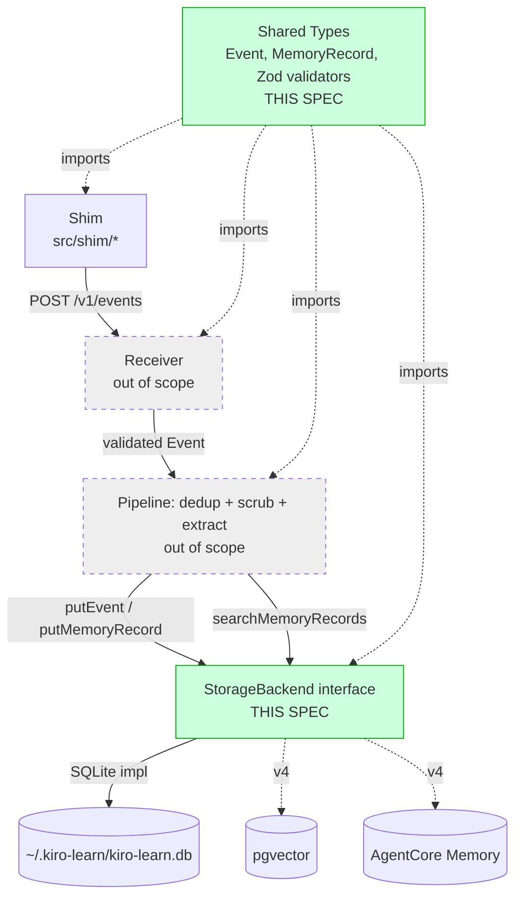
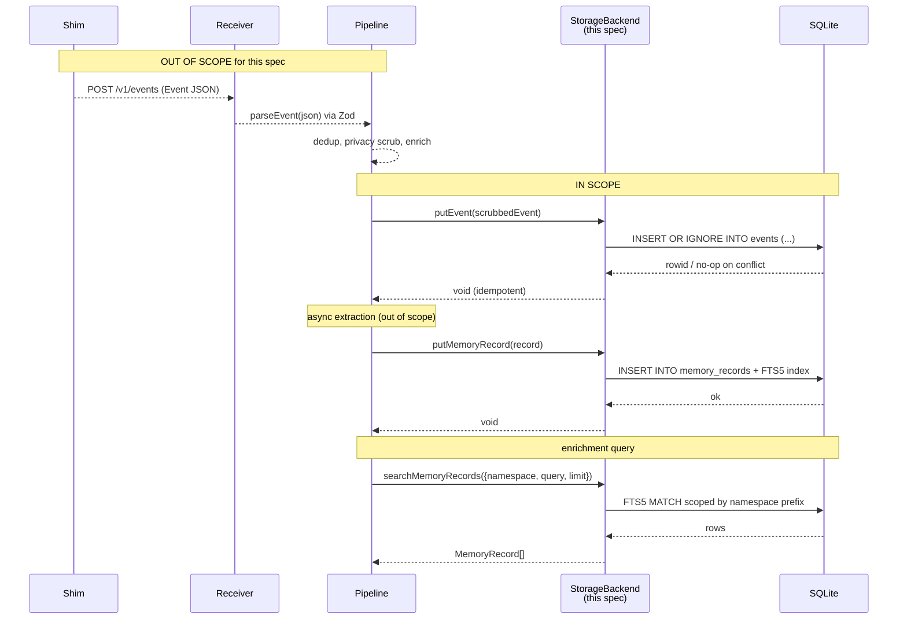
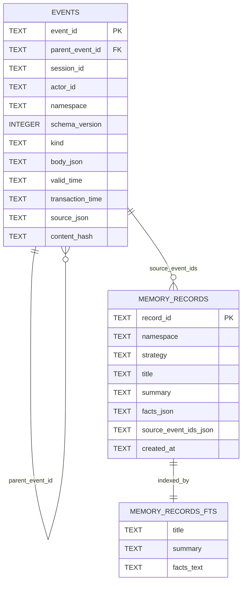

# Design Document: Event Schema and Storage

## Overview

This spec defines the data foundation for kiro-learn: the canonical `Event` wire schema, the `MemoryRecord` storage shape, the `StorageBackend` interface that sits between the pipeline and persistence, and the SQLite + FTS5 implementation of that interface for v1. It also defines the migration runner that keeps the on-disk schema in step with the code.

The Event schema is a one-way door. v1 must carry every field needed to later absorb semantic-graph extraction, bi-temporal queries, multi-client sources, team/shared memory, and migration to Amazon Bedrock AgentCore Memory without a breaking change. The shape here mirrors AgentCore Memory's Event model exactly (event, memory record, session, actor, namespace, memory strategy) so a future migration becomes a field-mapping exercise, not a rewrite.

Storage is pluggable behind a small interface. v1 ships SQLite + FTS5 only; pgvector and AgentCore Memory adapters in later milestones implement the same interface without touching upstream code. The interface is deliberately minimal: `putEvent`, `putMemoryRecord`, `getEventById`, `searchMemoryRecords`, `close`. Bi-temporal columns (`valid_time`, `transaction_time`) are present in the DDL from day one but not surfaced as query parameters in v1.

## Architecture

### Component context

This spec owns the **types** package (`src/types/`) and the **storage** package (`src/collector/storage/`). Every other v1 component — receiver, pipeline, enrichment, query, shim, installer — either imports from these two packages or is out of scope for this spec. The downstream hand-off points are called out explicitly so the next specs have a fixed contract to build against.



### End-to-end sequence (for context)

The storage layer's role in the full flow. Dashed arrows are out of scope for this spec.



### Handoff contract to downstream specs

These are the exact seams other specs must bind to. They are stable for v1.

| Downstream spec | Calls into this spec | Precondition |
|-----------------|---------------------|--------------|
| **collector-receiver** | `parseEvent(unknown): Event` (Zod) | HTTP body parsed to JSON |
| **collector-pipeline** | `StorageBackend.putEvent(event)` | Privacy scrub complete; `<private>` spans removed |
| **collector-pipeline** | `StorageBackend.putMemoryRecord(record)` | Extraction produced a structured record |
| **collector-enrichment** | `StorageBackend.searchMemoryRecords({ namespace, query, limit })` | Request arrived with resolved namespace |
| **installer** | `openSqliteStorage({ dbPath })` and migration bootstrap | Install directory exists |

**Privacy contract.** The storage layer does not scrub `<private>...</private>` spans. That belongs to the pipeline. But storage writes happen *after* scrubbing: `putEvent` is the sink, not a gatekeeper, and the pipeline is responsible for passing in already-scrubbed content. This spec documents that contract; the collector-pipeline spec implements it.

## Components and Interfaces

### Component 1: Shared Types (`src/types/`)

**Purpose.** Defines the canonical TypeScript types for `Event`, `MemoryRecord`, and `StorageBackend`. These are the contracts every v1 component imports. Re-exported from `src/index.ts` for external consumers.

**Interface.** See [Model: KiroMemEvent](#model-kiromemevent) and [Model: MemoryRecord](#model-memoryrecord) for full TypeScript shapes.

**Responsibilities.**
- Define `KiroMemEvent`, `MemoryRecord`, `StorageBackend` as TypeScript types.
- Provide Zod schemas (`EventSchema`, `MemoryRecordSchema`) for runtime validation.
- Provide `parseEvent(unknown): KiroMemEvent` and `parseMemoryRecord(unknown): MemoryRecord` helpers.
- Document every field so downstream specs have a single source of truth.

**Non-responsibilities.**
- No I/O. No logging. No error handling beyond what Zod surfaces.

### Component 2: StorageBackend Interface (`src/collector/storage/index.ts`)

**Purpose.** The single abstraction every storage implementation obeys. Named after AgentCore Memory's primitives so a future adapter is a field-mapping exercise.

**Interface.**
```typescript
export interface StorageBackend {
  putEvent(event: KiroMemEvent): Promise<void>;
  getEventById(eventId: string): Promise<KiroMemEvent | null>;
  putMemoryRecord(record: MemoryRecord): Promise<void>;
  searchMemoryRecords(params: SearchParams): Promise<MemoryRecord[]>;
  close(): Promise<void>;
}

export interface SearchParams {
  namespace: string;   // exact prefix; caller controls trailing slash
  query: string;       // FTS5-compatible query string, or plain text
  limit: number;       // max rows to return; must be > 0
}
```

**Responsibilities.**
- Define the contract (method signatures + behavioral invariants).
- Document idempotency, namespace-scoping, and bi-temporal semantics.

**Non-responsibilities.**
- Does not mandate a specific database. SQLite is the v1 implementation; other adapters live next to it.

### Component 3: SQLite Backend (`src/collector/storage/sqlite/`)

**Purpose.** v1 implementation. Zero-dependency, single-file local store. Uses `better-sqlite3` (v12+) synchronous API under the hood, wrapped in `Promise.resolve(...)` to satisfy the async interface. Idempotent writes. FTS5 index for memory-record search.

**Public surface.**
```typescript
export interface SqliteStorageOptions {
  dbPath: string;              // e.g. ~/.kiro-learn/kiro-learn.db
  // Optional advanced knobs live on the options type but have sensible defaults.
  // Not exposed for v1 consumers outside tests.
}

export function openSqliteStorage(opts: SqliteStorageOptions): StorageBackend;
```

**Responsibilities.**
- Open (or create) the SQLite database at `opts.dbPath`.
- Apply pending migrations on startup via the migration runner.
- Implement every `StorageBackend` method against SQLite + FTS5.
- Use prepared statements for every query. Never interpolate SQL.
- Assign `transaction_time` on `putEvent` if the pipeline has not already set it. (The interface leaves this as a collector responsibility; SQLite stamps a fallback to guarantee a non-null value.)
- Serialize `body` and `source` as JSON TEXT columns (schema versioning protection, forward compat).
- Dedup by `event_id` using `INSERT OR IGNORE`.

**Non-responsibilities.**
- No business logic. No privacy scrub. No dedup beyond the PK constraint.
- No backup/encryption. SQLite file is a plain file on the developer's own machine under `~/.kiro-learn/`. The `.gitignore` already excludes `~/.kiro-learn/`. File-system permissions default to the owning user.

### Component 4: Migration Runner (`src/collector/storage/sqlite/migrations/`)

**Purpose.** Versioned, append-only DDL stack. Every migration is numbered and embedded as a TypeScript string constant so the compiled `dist/` is self-contained (no file-system discovery at runtime).

**Interface.**
```typescript
export interface Migration {
  version: number;
  name: string;
  up: (db: Database) => void;   // better-sqlite3 Database
}

export function runMigrations(db: Database, migrations: Migration[]): void;
```

**Responsibilities.**
- Create `_migrations` bookkeeping table on first open.
- Apply every migration with `version > MAX(applied_version)` inside a transaction.
- Fail loudly if a migration's recorded name disagrees with the embedded one (detects reordering).
- Be idempotent: running twice applies nothing the second time.

**Non-responsibilities.**
- No down-migrations. v1 is forward-only.
- No online migrations. Happy-path upgrade path is "stop daemon, open DB, migrate, start daemon" — consistent with the installer's v1 constraints in AGENTS.md.

## Data Models

### Event (wire + storage)

The wire format is the JSON shape posted to `/v1/events`. The storage format is one row per event with JSON columns for the variable-shape parts.



**Validation rules (Event).**
- `event_id` — ULID; 26 chars; Crockford base32; regex `^[0-9A-HJKMNP-TV-Z]{26}$`. Unique.
- `parent_event_id` — optional; same format as `event_id`; no FK enforcement in v1 (the parent may arrive later if events race).
- `session_id` — non-empty string, ≤ 128 chars.
- `actor_id` — non-empty string, ≤ 128 chars.
- `namespace` — non-empty; must match `^/actor/[^/]+/project/[^/]+/$`. Trailing slash mandatory (AgentCore convention, enables prefix-safe scoping).
- `schema_version` — literal `1` in v1. Future versions extend.
- `kind` — one of `prompt | tool_use | session_summary | note`.
- `body` — discriminated union on `type`:
  - `{ type: 'text', content: string }` — `content` length ≤ 1 MiB.
  - `{ type: 'message', turns: Array<{ role: string; content: string }> }` — total serialized size ≤ 1 MiB.
  - `{ type: 'json', data: unknown }` — serialized size ≤ 1 MiB.
- `valid_time` — ISO 8601 string, must parse via `Date` and round-trip.
- `source.surface` — `'kiro-cli' | 'kiro-ide'` (v1 only emits `kiro-cli`).
- `source.version` — non-empty string.
- `source.client_id` — non-empty string.
- `content_hash` — optional; if present, must match `^sha256:[0-9a-f]{64}$`.

**Validation rules (MemoryRecord).**
- `record_id` — `^mr_[0-9A-HJKMNP-TV-Z]{26}$` (ULID with `mr_` prefix).
- `namespace` — same regex as Event.
- `strategy` — non-empty string; v1 uses `"llm-summary"`.
- `title` — 1–200 chars.
- `summary` — 1–4000 chars.
- `facts` — array of strings, each 1–500 chars; total ≤ 8 KiB.
- `source_event_ids` — non-empty array of ULIDs.
- `created_at` — ISO 8601.

### Model: KiroMemEvent

```typescript
export type EventKind = 'prompt' | 'tool_use' | 'session_summary' | 'note';

export type EventBody =
  | { type: 'text'; content: string }
  | { type: 'message'; turns: Array<{ role: string; content: string }> }
  | { type: 'json'; data: unknown };

export interface EventSource {
  surface: 'kiro-cli' | 'kiro-ide';
  version: string;
  client_id: string;
}

export interface KiroMemEvent {
  event_id: string;
  parent_event_id?: string;
  session_id: string;
  actor_id: string;
  namespace: string;
  schema_version: 1;
  kind: EventKind;
  body: EventBody;
  valid_time: string;
  source: EventSource;
  content_hash?: string;
}
```

### Model: MemoryRecord

```typescript
export interface MemoryRecord {
  record_id: string;
  namespace: string;
  strategy: string;
  title: string;
  summary: string;
  facts: string[];
  source_event_ids: string[];
  created_at: string;
}
```

### Model: StoredEvent (internal)

Not exported. Represents the shape as it leaves the DB before reassembling into `KiroMemEvent`. Includes the collector-assigned `transaction_time`.

```typescript
interface StoredEvent extends KiroMemEvent {
  transaction_time: string;   // ISO 8601, assigned at putEvent time
}
```

v1 does not surface `transaction_time` through the public `StorageBackend` interface (the bi-temporal read path isn't built yet). It is written and retained so v5's point-in-time queries can light up without a data backfill.

## SQLite DDL (migration 0001)

```sql
-- Every text column uses NOCASE? No. Defaults to BINARY; IDs are case-sensitive.

CREATE TABLE IF NOT EXISTS events (
  event_id         TEXT PRIMARY KEY,
  parent_event_id  TEXT,
  session_id       TEXT NOT NULL,
  actor_id         TEXT NOT NULL,
  namespace        TEXT NOT NULL,
  schema_version   INTEGER NOT NULL,
  kind             TEXT NOT NULL CHECK (kind IN ('prompt','tool_use','session_summary','note')),
  body_json        TEXT NOT NULL,
  valid_time       TEXT NOT NULL,
  transaction_time TEXT NOT NULL,
  source_json      TEXT NOT NULL,
  content_hash     TEXT
) STRICT;

CREATE INDEX IF NOT EXISTS idx_events_namespace_valid
  ON events (namespace, valid_time);
CREATE INDEX IF NOT EXISTS idx_events_session
  ON events (session_id);
CREATE INDEX IF NOT EXISTS idx_events_parent
  ON events (parent_event_id);

CREATE TABLE IF NOT EXISTS memory_records (
  record_id             TEXT PRIMARY KEY,
  namespace             TEXT NOT NULL,
  strategy              TEXT NOT NULL,
  title                 TEXT NOT NULL,
  summary               TEXT NOT NULL,
  facts_json            TEXT NOT NULL,
  source_event_ids_json TEXT NOT NULL,
  created_at            TEXT NOT NULL
) STRICT;

CREATE INDEX IF NOT EXISTS idx_memory_records_namespace
  ON memory_records (namespace);

-- FTS5 virtual table for memory-record text search. Regular (non-contentless)
-- FTS5 table; both the primary row and the FTS row are inserted in the same
-- transaction. See Notes below.
CREATE VIRTUAL TABLE IF NOT EXISTS memory_records_fts USING fts5(
  record_id UNINDEXED,
  namespace UNINDEXED,
  title,
  summary,
  facts_text,
  tokenize = 'porter unicode61 remove_diacritics 2'
);

CREATE TABLE IF NOT EXISTS _migrations (
  version    INTEGER PRIMARY KEY,
  name       TEXT NOT NULL,
  applied_at TEXT NOT NULL
) STRICT;
```

**Notes.**
- `STRICT` tables (SQLite 3.37+, available in `better-sqlite3` v12) enforce column types — prevents silent coercion bugs.
- FTS5 uses the `porter` stemmer with `unicode61` tokenizer and diacritic removal: standard choice for English-language text with resilience to accented input.
- `memory_records_fts` is a regular (non-contentless) FTS5 table. We insert both the primary row and the FTS row in the same transaction. That costs a bit of disk but avoids the contentless-FTS5 trigger dance, which is error-prone and not worth it at v1 scale.
- `content_hash` is nullable: the collector derives it if the client omits it. The SQLite layer stores whatever the pipeline handed over.
- We do **not** put a foreign key from `parent_event_id → event_id`. Events can arrive out of order and the FK would force ordering guarantees on the shim that aren't worth enforcing.

## Key Functions with Formal Specifications

### `parseEvent(input: unknown): KiroMemEvent`

Zod-backed parser. Throws `ZodError` on any violation.

```typescript
export function parseEvent(input: unknown): KiroMemEvent;
```

**Preconditions.**
- `input` may be anything. The whole point of this function is to validate.

**Postconditions.**
- On success, returns a `KiroMemEvent` that satisfies every rule in the [Validation rules (Event)](#event-wire--storage) section above.
- On failure, throws `ZodError` with a field path and message.
- Does not mutate `input`.
- Pure — no I/O, no clock reads, no randomness.

### `StorageBackend.putEvent(event: KiroMemEvent): Promise<void>`

Idempotent insert.

**Preconditions.**
- `event` has already been validated by the pipeline (normally via `parseEvent`).
- `event.body` content has been privacy-scrubbed; no `<private>...</private>` spans remain. Storage does not check this — it is the pipeline's contract.
- DB is open; migrations have been applied.

**Postconditions.**
- If no row exists with `event_id = event.event_id`, a new row is inserted and a `transaction_time` is stamped (ISO 8601, UTC).
- If a row already exists, the call is a no-op (idempotency). The existing row is **not** mutated.
- Return value is `void` either way.
- On any other error (I/O, constraint violation beyond PK), rejects with the underlying error.

**Loop invariants.** N/A — single-row insert.

### `StorageBackend.getEventById(eventId: string): Promise<KiroMemEvent | null>`

**Preconditions.**
- `eventId` is a string (ULID format not enforced here; search just won't match non-ULIDs).

**Postconditions.**
- Returns the full `KiroMemEvent` (minus `transaction_time`, which is internal) if a row exists.
- Returns `null` otherwise.
- Does not throw for the not-found case.

### `StorageBackend.putMemoryRecord(record: MemoryRecord): Promise<void>`

**Preconditions.**
- `record` has been validated via `parseMemoryRecord`.
- `record.record_id` is unique.

**Postconditions.**
- Inserts into `memory_records` and `memory_records_fts` atomically (single transaction).
- On `record_id` collision, rejects (records should not collide; it would indicate a bug).
- Return value is `void`.

### `StorageBackend.searchMemoryRecords(params): Promise<MemoryRecord[]>`

**Preconditions.**
- `params.namespace` matches the namespace regex.
- `params.query` is a non-empty string.
- `params.limit > 0`.

**Postconditions.**
- Returns at most `params.limit` records.
- Every returned record has `record.namespace` starting with `params.namespace` (prefix match; namespace isolation).
- Results are ordered by FTS5 rank (best match first).
- If FTS5 rejects the query as malformed (user-controlled chars like `"` or `*`), the function falls back to an escaped LIKE match over `title || ' ' || summary` to preserve availability. Documented as a fallback; rank in that case is "most recent first" by `created_at DESC`.

**Loop invariants.** N/A — prepared statement returns a bounded result set.

## Algorithmic Pseudocode

### Migration runner

```pascal
ALGORITHM runMigrations(db, migrations)
INPUT: db (open SQLite handle), migrations (sorted ascending by version)
OUTPUT: void; db has all migrations applied.

BEGIN
  ASSERT migrations are strictly ascending by version (gaps are permitted)
  ASSERT every version is distinct

  EXECUTE "CREATE TABLE IF NOT EXISTS _migrations (version INTEGER PRIMARY KEY,
                                                   name TEXT NOT NULL,
                                                   applied_at TEXT NOT NULL) STRICT"

  applied ← SELECT version, name FROM _migrations ORDER BY version
  FOR each (version, name) IN applied DO
    IF NOT EXISTS m IN migrations WHERE m.version = version AND m.name = name THEN
      THROW "migration drift: DB has {version} {name}, code does not"
    END IF
  END FOR

  max_applied ← applied.last.version OR 0

  FOR each m IN migrations WHERE m.version > max_applied DO
    BEGIN TRANSACTION
      m.up(db)
      INSERT INTO _migrations (version, name, applied_at)
             VALUES (m.version, m.name, now_iso8601())
    COMMIT
  END FOR

  ASSERT all migrations with version <= migrations.last.version are in _migrations
END
```

**Preconditions.** `db` is open, no other writer is active, migrations list is well-formed.
**Postconditions.** `_migrations` records every applied version with `applied_at` in UTC.
**Loop invariants.** For each iteration, all migrations with version ≤ current have been committed or the whole transaction has rolled back.

### putEvent (SQLite)

```pascal
ALGORITHM putEvent(event)
INPUT: event ∈ KiroMemEvent (already validated, already scrubbed)
OUTPUT: void

BEGIN
  ASSERT event has passed parseEvent

  tx_time ← now_iso8601_utc()

  EXECUTE prepared statement:
    INSERT OR IGNORE INTO events (
      event_id, parent_event_id, session_id, actor_id,
      namespace, schema_version, kind, body_json,
      valid_time, transaction_time, source_json, content_hash
    ) VALUES (?, ?, ?, ?, ?, ?, ?, ?, ?, ?, ?, ?)

  // INSERT OR IGNORE is our idempotency primitive.
  // changes() returns 0 if the event already existed; we do not care.
END
```

**Preconditions.** Event is validated and scrubbed. DB open. Migrations applied.
**Postconditions.** Either the event is newly persisted with `transaction_time = tx_time`, or the existing row is unchanged.

### searchMemoryRecords (SQLite, FTS5 path)

```pascal
ALGORITHM searchMemoryRecords(namespace, query, limit)
INPUT: namespace (matches namespace regex), query (non-empty), limit (> 0)
OUTPUT: records: MemoryRecord[]

BEGIN
  ASSERT namespace matches /^/actor/[^/]+/project/[^/]+/$/
  ASSERT query ≠ ""
  ASSERT limit > 0

  escaped_query ← sanitizeForFts5(query)

  TRY
    rows ← EXECUTE:
      SELECT mr.record_id, mr.namespace, mr.strategy, mr.title, mr.summary,
             mr.facts_json, mr.source_event_ids_json, mr.created_at
      FROM memory_records_fts fts
      JOIN memory_records mr ON mr.record_id = fts.record_id
      WHERE fts MATCH ?
        AND mr.namespace LIKE ? || '%'   -- prefix-scoped; preserves isolation
      ORDER BY fts.rank
      LIMIT ?
      -- params: (escaped_query, namespace, limit)
  CATCH any error from the MATCH query  // FTS5 malformed query or other SQLite error
    rows ← EXECUTE:
      SELECT ...
      FROM memory_records mr
      WHERE mr.namespace LIKE ? || '%'
        AND (mr.title LIKE ? OR mr.summary LIKE ?)
      ORDER BY mr.created_at DESC
      LIMIT ?
      -- params: (namespace, '%'||escape_like(query)||'%', '%'||escape_like(query)||'%', limit)
  END TRY

  RETURN rows.map(deserializeMemoryRecord)
END

FUNCTION sanitizeForFts5(q)
  // FTS5 has special chars: " * ( ) : NEAR AND OR NOT
  // v1 strategy: quote the whole thing to treat it as a phrase,
  // and double any embedded quotes. Simple and safe.
  RETURN '"' + q.replaceAll('"', '""') + '"'
END FUNCTION
```

**Preconditions.** Namespace is valid, query non-empty, limit positive. DB open.
**Postconditions.**
- ∀ r ∈ result: r.namespace starts with namespace
- |result| ≤ limit
- No record outside the namespace prefix is returned (isolation).

**Loop invariants.** SQLite enforces `LIMIT`; the result accumulator is bounded by the DB engine.

## Example Usage

```typescript
// 1) Validate an incoming payload (receiver/pipeline boundary).
import { parseEvent } from 'kiro-learn/types';

const event = parseEvent(requestBody);   // throws ZodError on bad input

// 2) Open storage (collector bootstrap).
import { openSqliteStorage } from 'kiro-learn/collector/storage/sqlite';

const storage = openSqliteStorage({
  dbPath: path.join(os.homedir(), '.kiro-learn', 'kiro-learn.db'),
});
// Migrations run on open. Ready to use.

// 3) Idempotent write.
await storage.putEvent(event);
await storage.putEvent(event);   // no-op; same event_id

// 4) Memory record after extraction.
await storage.putMemoryRecord({
  record_id: 'mr_01JF8ZS4Z0000000000000000',
  namespace: event.namespace,
  strategy: 'llm-summary',
  title: 'User investigated auth flow',
  summary: 'Read src/auth/*, identified missing refresh-token rotation.',
  facts: [
    'refresh tokens not rotated on use',
    'login endpoint is /v1/auth/login',
  ],
  source_event_ids: [event.event_id],
  created_at: new Date().toISOString(),
});

// 5) Enrichment query.
const matches = await storage.searchMemoryRecords({
  namespace: event.namespace,
  query: 'refresh token rotation',
  limit: 5,
});

// 6) Round-trip.
const stored = await storage.getEventById(event.event_id);
// stored deep-equals event (every public field).

await storage.close();
```

## Zod Schemas

Wire-level validators. Source of truth for runtime validation and for the test suite's fixture generators.

```typescript
import { z } from 'zod';

export const ULID_RE = /^[0-9A-HJKMNP-TV-Z]{26}$/;
export const RECORD_ID_RE = /^mr_[0-9A-HJKMNP-TV-Z]{26}$/;
export const NAMESPACE_RE = /^\/actor\/[^/]+\/project\/[^/]+\/$/;
export const CONTENT_HASH_RE = /^sha256:[0-9a-f]{64}$/;

export const EventBodySchema = z.discriminatedUnion('type', [
  z.object({ type: z.literal('text'), content: z.string().max(1_048_576) }),
  z.object({
    type: z.literal('message'),
    turns: z.array(z.object({ role: z.string().min(1), content: z.string() })).min(1),
  }),
  z.object({ type: z.literal('json'), data: z.unknown() }),
]);

export const EventSourceSchema = z.object({
  surface: z.enum(['kiro-cli', 'kiro-ide']),
  version: z.string().min(1),
  client_id: z.string().min(1),
});

export const EventSchema = z.object({
  event_id: z.string().regex(ULID_RE),
  parent_event_id: z.string().regex(ULID_RE).optional(),
  session_id: z.string().min(1).max(128),
  actor_id: z.string().min(1).max(128),
  namespace: z.string().regex(NAMESPACE_RE),
  schema_version: z.literal(1),
  kind: z.enum(['prompt', 'tool_use', 'session_summary', 'note']),
  body: EventBodySchema,
  valid_time: z.string().datetime({ offset: true }),
  source: EventSourceSchema,
  content_hash: z.string().regex(CONTENT_HASH_RE).optional(),
});

export const MemoryRecordSchema = z.object({
  record_id: z.string().regex(RECORD_ID_RE),
  namespace: z.string().regex(NAMESPACE_RE),
  strategy: z.string().min(1),
  title: z.string().min(1).max(200),
  summary: z.string().min(1).max(4000),
  facts: z.array(z.string().min(1).max(500)),
  source_event_ids: z.array(z.string().regex(ULID_RE)).min(1),
  created_at: z.string().datetime({ offset: true }),
});

export type KiroMemEvent = z.infer<typeof EventSchema>;
export type MemoryRecord = z.infer<typeof MemoryRecordSchema>;

export function parseEvent(input: unknown): KiroMemEvent {
  return EventSchema.parse(input);
}

export function parseMemoryRecord(input: unknown): MemoryRecord {
  return MemoryRecordSchema.parse(input);
}
```

**Note on field definitions.** The TypeScript types currently hand-written in `src/types/index.ts` are replaced by `z.infer` exports from the Zod schemas. This keeps the runtime validator and the compile-time type in lockstep. Downstream specs continue to import from `src/types/index.ts`; the re-export surface is unchanged.

## Correctness Properties

These are the property-based tests this spec must satisfy. They anchor the `tasks.md` PBT work and are the bar for "implementation correct."

### P1. Event round-trip integrity

```
∀ e ∈ validEvents(): 
  putEvent(e); 
  let stored = getEventById(e.event_id);
  stored deep-equals e  (ignoring transaction_time which is internal)
```

### P2. putEvent idempotency

```
∀ e ∈ validEvents():
  putEvent(e);
  let t1 = readTransactionTime(e.event_id);
  putEvent(e);
  let t2 = readTransactionTime(e.event_id);
  t1 === t2                             -- no re-stamp
  rowCountForEventId(e.event_id) === 1  -- no duplicate
```

### P3. Namespace isolation

```
∀ (n1, n2) ∈ distinct namespaces × random record populations:
  populate storage with records under n1 and n2;
  let hits = searchMemoryRecords({ namespace: n1, query, limit: 100 });
  ∀ h ∈ hits: h.namespace starts with n1
  no record under n2 appears in hits
```

### P4. Schema invariants on every stored row

```
∀ e stored in events table:
  parseEvent(reconstructedJson) succeeds  -- Zod accepts it
  e.schema_version === 1
  e.namespace matches NAMESPACE_RE
  Date.parse(e.valid_time) is finite
  Date.parse(e.transaction_time) is finite
  e.transaction_time >= e.valid_time  -- arrived after or at occurrence
```

Note on P4's last line: this is only required for events where the pipeline did not back-date `valid_time` deliberately. In practice the bound is generous because clock skew is real; we document it as a soft invariant and test with a tolerance.

### P5. parseEvent rejects invalid input

```
∀ bad ∈ arbitrary non-Event values (mutations that break exactly one rule):
  parseEvent(bad) throws ZodError
  the error path identifies the broken field
```

### P6. Migration runner idempotency

```
∀ migrations-list M:
  runMigrations(db, M);
  let snapshot1 = schemaAndMigrationsTable(db);
  runMigrations(db, M);
  let snapshot2 = schemaAndMigrationsTable(db);
  snapshot1 === snapshot2
```

## Error Handling

### Error: invalid event payload

**Condition.** `parseEvent` throws `ZodError`.
**Response.** Error propagates. The receiver (out of scope) turns it into an HTTP 400.
**Recovery.** Caller fixes the event; the shim's local spool is preserved.

### Error: `putEvent` called with duplicate `event_id`

**Condition.** Row with same `event_id` already exists.
**Response.** Silent no-op (idempotency is the contract).
**Recovery.** None required.

### Error: SQLite I/O failure (disk full, permissions, corrupt DB)

**Condition.** `better-sqlite3` throws.
**Response.** Rejects the promise with the underlying error. Error includes the offending `event_id` or `record_id` when relevant.
**Recovery.** Caller retries or surfaces the error. The collector pipeline is responsible for retry/backoff policy — out of scope for this spec.

### Error: Migration fails mid-run

**Condition.** A migration's `up` throws.
**Response.** The enclosing transaction rolls back. The `_migrations` row is not inserted. The runner rethrows.
**Recovery.** The collector process exits non-zero. Installer/operator inspects logs and fixes. v1 does not attempt recovery.

### Error: Migration drift detected

**Condition.** A version recorded in `_migrations` has a `name` that disagrees with the code's embedded migration of that version.
**Response.** Runner throws `MigrationDriftError` at open time.
**Recovery.** Only by manual intervention. Indicates either database from a future/foreign build or a developer reorder of history. Not expected in production.

### Error: `searchMemoryRecords` with malformed FTS5 query

**Condition.** User query contains FTS5-reserved tokens that even `sanitizeForFts5` can't handle.
**Response.** Falls back to the LIKE path (see [searchMemoryRecords algorithm](#searchmemoryrecords-sqlite-fts5-path)). Never fails the enrichment request purely over a query-format issue.
**Recovery.** Automatic.

## Testing Strategy

### Unit tests

- `parseEvent` accepts every field permutation in the Zod schema.
- `parseEvent` rejects each of: wrong ULID shape, wrong namespace shape, `schema_version !== 1`, unknown `kind`, unknown `body.type`, oversized body, missing required field, malformed `valid_time`.
- `parseMemoryRecord` mirror coverage.
- SQLite backend: single-event write, duplicate write, retrieve, not-found, record write + retrieve, search by query, search by namespace prefix, empty search, close idempotent.
- Migration runner: applies from empty DB, applies from partial DB, no-ops on current DB, detects drift, rolls back on failure.

### Property-based tests

**Library.** `fast-check` (peer-dependency choice: broadly used, TypeScript-first, works with vitest). Added as a dev dependency for this spec; installer does not ship it.

**Generators.** An `arbitraryEvent()` combinator produces valid `KiroMemEvent` values drawn from the full shape (ULID generator, namespace builder, body variants, edge-case valid times including far-future and epoch). A shrinker is the default `fast-check` shrinker; counterexamples are reproducible via a stable seed logged on failure.

**Properties tested.** P1–P6 from [Correctness Properties](#correctness-properties).

### Integration tests

- Open a real SQLite file in a temp dir → run migrations → write 100 events → read them back.
- Open the same file twice (close / reopen) and confirm data persists and migrations do not re-run.
- FTS5 search returns results across a realistic corpus (≥ 1000 memory records) under 50 ms on a laptop. (Performance-budget sanity check; not a PBT.)

## Performance Considerations

v1 scale target: a single developer, one Kiro session at a time, tens of events per minute at peak, single-digit megabytes of memory-record corpus. SQLite handles this trivially.

- **Write path.** `putEvent` is a single prepared-statement `INSERT OR IGNORE`. No fsync-per-insert thrash; `better-sqlite3` defaults are fine.
- **FTS5 index.** `porter + unicode61` is proven in open-source projects at corpus sizes three orders of magnitude above ours.
- **No WAL tuning in v1.** `better-sqlite3` uses SQLite's default journal mode (DELETE/rollback journal) unless WAL is explicitly enabled via `db.pragma('journal_mode = WAL')`. The codebase currently does not set that pragma, so the storage backend operates in DELETE mode. If we hit concurrency issues with the enrichment read path later, we enable WAL and revisit.
- **Connection model.** One long-lived `Database` handle per process. `better-sqlite3` is synchronous; the `Promise.resolve` wrapping is a cost of interface compatibility, not of runtime.

## Security Considerations

- **Local-first, single-user.** The SQLite file lives under `~/.kiro-learn/` on the developer's own machine. Default POSIX permissions inherit the user's umask (`0700` for the directory, owner-rw for the file). This spec does not add encryption-at-rest; the threat model is "attacker has already read your home directory" which is equivalent to reading your chat logs.
- **Privacy contract.** Storage does not scrub `<private>...</private>` spans. The pipeline spec owns that. This spec documents it (see [Handoff contract](#handoff-contract-to-downstream-specs)) and will be re-tested at the pipeline layer.
- **SQL injection.** Every query uses prepared statements. FTS5 user input is quoted as a phrase; a fallback LIKE path escapes `%` and `_`. No string concatenation into SQL anywhere.
- **Input validation.** Every Event crossing a trust boundary passes through `parseEvent` (Zod). Aligns with organizational input-validation guidance ([BSC1](https://arcc.example/cnt_u7sfVeParu7OlX)): allowlist-based validation, whole-object shape checks, strict literal enums.
- **DoS via oversized body.** Bodies are capped at 1 MiB in the Zod validator. Oversized payloads reject at the receiver boundary, not at storage.
- **No secrets in this layer.** Storage does not hold credentials, tokens, or keys. If an Event body contains a secret because the user typed one, privacy scrub is the relevant control — owned by the pipeline spec.
- **Cloud posture (for later specs).** ARCC guidance on encryption-at-rest, TLS, KMS, IAM, and data-plane logging applies to the v4 cloud path (pgvector on Aurora, AgentCore Memory). It does not apply to the v1 local SQLite file. The interface does not leak anything that would prevent those controls being added later.

## Dependencies

### Runtime

- `better-sqlite3` ^12 — synchronous SQLite driver. v12+ required for `STRICT` tables and reliable FTS5 behavior.
- `zod` ^3.23 — runtime schema validation.
- `ulid` ^2 (optional, if we generate ULIDs in tests or fallback code). Collectors receive ULIDs from shims; this spec does not require a generator on the hot path.

### Dev (added for this spec)

- `@types/better-sqlite3`
- `fast-check` — property-based tests.

### Already present

- `typescript`, `vitest`, `@types/node` — already in `package.json`.

## Future-proofing Notes

- **Bi-temporal.** `valid_time` + `transaction_time` are both stored. v5's point-in-time queries arrive as a new method on `StorageBackend` (additive) without schema migration.
- **Semantic graph.** `parent_event_id` is the only structural edge at ingest. v5's semantic graph strategy derives further relations on extraction — does not require ingest-time schema change.
- **Embeddings (v2).** A future migration adds a `memory_record_embeddings(record_id, vector)` table. SQLite + `sqlite-vec` or a swap to pgvector. The `searchMemoryRecords` method gains a hybrid behavior but the signature remains the same.
- **AgentCore migration (v4).** Every field here has a direct counterpart in AgentCore Memory's Event and memory-record models. Migration is an exporter that reads our rows and POSTs to the managed service.
- **Team/shared memory (v4).** `namespace` is a prefix-safe string. Future IAM scoping attaches policies to namespace prefixes — requires zero change to this layer.
