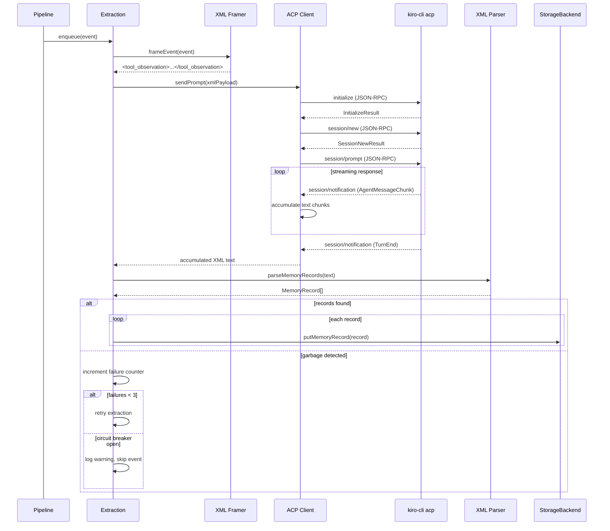

# Design Document: XML Extraction Pipeline

## Overview

This spec replaces the current `kiro-cli chat --no-interactive` extraction approach with a structured XML-based extraction pipeline using `kiro-cli acp` (Agent Client Protocol) over stdio. The current implementation suffers from fragile JSON parsing of ANSI-decorated CLI output, conversational model responses instead of structured output, and brittle string stripping. The new approach uses XML for both input framing (wrapping tool observations in `<tool_observation>` tags) and output parsing (extracting `<memory_record>` blocks), communicating over a clean JSON-RPC 2.0 transport with no terminal decoration.

The design follows the same pattern as claude-mem's proven XML extraction: XML-in/XML-out with regex-based parsing, deterministic structure, and a circuit breaker for garbage detection. It preserves the existing pipeline architecture — the extraction stage's `spawnKiroCli` function is the only seam that changes. Everything upstream (dedup, privacy scrub, storage) and downstream (putMemoryRecord) remains untouched.

**In scope:** ACP client protocol, XML input framing, XML output parsing, updated compressor agent config, MemoryRecord schema extension (concepts, files_touched, observation_type), circuit breaker for extraction failures, installer updates for the new compressor prompt.

**Out of scope:** Pipeline stage ordering changes, storage backend changes, retrieval/query changes, new event kinds, shim changes, embeddings.

## Architecture

### Component Context

```mermaid
graph TD
    Pipeline[Pipeline<br/>src/collector/pipeline/index.ts] -->|enqueue event| Extraction[Extraction Stage<br/>createExtractionStage]
    Extraction -->|spawn| ACP[ACP Client<br/>src/collector/pipeline/acp-client.ts]
    ACP -->|stdio JSON-RPC 2.0| KiroCLI[kiro-cli acp<br/>--agent kiro-learn-compressor]
    KiroCLI -->|AgentMessageChunk| ACP
    KiroCLI -->|TurnEnd| ACP
    ACP -->|raw XML text| XMLParser[XML Parser<br/>src/collector/pipeline/xml-parser.ts]
    XMLParser -->|MemoryRecord[]| Extraction
    Extraction -->|putMemoryRecord| SB[StorageBackend]

    Framer[XML Framer<br/>src/collector/pipeline/xml-framer.ts] -->|tool_observation XML| ACP

    style ACP fill:#cfd,stroke:#0a0
    style XMLParser fill:#cfd,stroke:#0a0
    style Framer fill:#cfd,stroke:#0a0
    style Extraction fill:#ffc,stroke:#aa0
    style Pipeline fill:#eee,stroke:#999
    style SB fill:#eee,stroke:#999
    style KiroCLI fill:#eee,stroke:#999
```

Green = new modules in this spec. Yellow = modified. Grey = unchanged.

### End-to-End Sequence



### Modularity Boundary

| Module | May import from | Must NOT import from |
|--------|----------------|---------------------|
| `src/collector/pipeline/acp-client.ts` | `node:child_process`, `node:stream`, `@agentclientprotocol/sdk` | `src/collector/storage/` |
| `src/collector/pipeline/xml-framer.ts` | `src/types/` | `src/collector/storage/` |
| `src/collector/pipeline/xml-parser.ts` | `src/types/` | `src/collector/storage/` |
| `src/collector/pipeline/index.ts` | All pipeline modules, `src/types/`, `src/collector/storage/index.ts` (types only) | `src/collector/storage/sqlite/` |
| `src/installer/index.ts` | `node:fs`, `node:path`, `node:os` | `src/collector/` |

The ACP client, XML framer, and XML parser are pure pipeline-internal modules. They interact with storage only through the existing `ExtractionStage` → `StorageBackend` path.

## Components and Interfaces

### Component 1: ACP Client (`src/collector/pipeline/acp-client.ts`)

**Purpose.** Manages the lifecycle of a `kiro-cli acp` child process and bridges it to the rest of the pipeline through a simple single-use `AcpSession` facade. All JSON-RPC framing, request/response correlation, and notification dispatch is delegated to the official `@agentclientprotocol/sdk` package. The ACP_Client module is a thin adapter — it spawns the process, wires stdio to the SDK's `ndJsonStream`, runs the handshake via the SDK's `ClientSideConnection`, and exposes a domain-specific API (`sendPrompt(xmlPayload) → responseText`) to the Extraction_Stage.

**Why the SDK and not hand-rolled protocol code.** An earlier iteration hand-rolled the JSON-RPC 2.0 plumbing and guessed the ACP handshake shape. Integration testing revealed five separate deviations from the actual protocol (see "Implementation Evolution" in requirements.md). Because ACP is an evolving open standard (currently at v0.20, published within the last few days of this writing), maintaining a hand-rolled implementation that tracks the spec is high-risk and low-value: the spec authors already publish a zero-dependency, typed SDK. Using it gives us protocol conformance for free, typed schemas for every message, and protocol updates on `npm update`.

**Interface.**

```typescript
import type { ChildProcess } from 'node:child_process';

/** Options for creating an ACP client. */
export interface AcpClientOptions {
  agentName: string;       // 'kiro-learn-compressor'
  timeoutMs: number;       // per-session timeout, default 30_000
}

/**
 * A single-use ACP session that sends one prompt and collects the response.
 *
 * This is a domain facade — it intentionally hides the underlying
 * ClientSideConnection / schema / stopReason / sessionUpdate machinery
 * so the rest of the pipeline does not need to know about ACP internals.
 */
export interface AcpSession {
  /**
   * Send a prompt and collect the full text response. Resolves when the
   * underlying `connection.prompt()` promise resolves (i.e. when the
   * agent turn ends with a stop reason).
   */
  sendPrompt(content: string): Promise<string>;
  /** Kill the child process and clean up. */
  destroy(): void;
}

/**
 * Spawn a kiro-cli acp process, construct a ClientSideConnection around
 * its stdio, run the initialize + newSession handshake, and return a
 * session ready to accept a single prompt.
 *
 * The returned AcpSession is single-use: one sendPrompt call per session.
 * The caller must call destroy() when done (or on error/timeout).
 */
export function createAcpSession(opts: AcpClientOptions): Promise<AcpSession>;
```

**Responsibilities.**
- Spawn `kiro-cli acp --agent <agentName>` as a child process with stdio pipes.
- Build an `ndJsonStream` from the child's stdout/stdin using the ACP_SDK helper.
- Construct a `ClientSideConnection` with a minimal `Client` handler:
  - `sessionUpdate(params)` — if `params.update.sessionUpdate === 'agent_message_chunk'`, append `params.update.content.text` to the current turn's accumulator. All other update kinds (`tool_call`, `tool_call_update`, `plan`, etc.) are ignored since the compressor agent has no tools.
  - `requestPermission(params)` — return `{ outcome: { outcome: 'cancelled' } }` as a defensive default. The compressor has no tools, so this handler should never be invoked in practice.
- Call `connection.initialize({ protocolVersion: 1, capabilities: {}, clientInfo: { name: 'kiro-learn', version: <pkg.version> } })`.
- Call `connection.newSession({ cwd: process.cwd(), mcpServers: [] })` and capture `sessionId` from the response.
- On `sendPrompt(xmlPayload)`:
  - Reset the accumulator.
  - Race `connection.prompt({ sessionId, prompt: [{ type: 'text', text: xmlPayload }] })` against a `setTimeout` of `timeoutMs`. The promise resolves with a `PromptResponse` carrying a `stopReason` when the turn ends.
  - On resolution, return the accumulated text.
  - On timeout, kill the child process and reject with a timeout error.
- `destroy()`: send SIGTERM, then SIGKILL after 2s if the process is still alive.

**Non-responsibilities.**
- No reconnection or session reuse. Each extraction gets a fresh process.
- No tool-call handling. The compressor agent is configured with zero tools.
- No JSON-RPC framing, request correlation, or notification parsing — all delegated to the SDK.
- No permission granting. The minimal `requestPermission` handler returns `cancelled` if it is ever called.


### Component 2: XML Framer (`src/collector/pipeline/xml-framer.ts`)

**Purpose.** Converts a `KiroMemEvent` into the XML `<tool_observation>` format that the compressor agent expects as input.

**Interface.**

```typescript
import type { KiroMemEvent } from '../../types/index.js';

/**
 * Frame an event as a <tool_observation> XML string for the compressor.
 *
 * Extracts tool_name, timestamp, cwd, input, and output from the event
 * body and wraps them in the XML schema the compressor prompt expects.
 */
export function frameEvent(event: KiroMemEvent): string;
```

**Responsibilities.**
- Extract structured fields from the event body based on `body.type`:
  - `json` body with `tool_name` field → use structured fields directly.
  - `text` body → wrap the entire content as the `<input>` element.
  - `message` body → concatenate turns as the `<input>` element.
- XML-escape all text content (`<`, `>`, `&`, `"`, `'`).
- Always include `<tool_name>`, `<timestamp>`, `<input>`. Include `<output>` and `<cwd>` when available.
- Return a well-formed XML string.

**Non-responsibilities.**
- No XML library dependency. The output structure is fixed and simple enough for string concatenation with escaping.

### Component 3: XML Parser (`src/collector/pipeline/xml-parser.ts`)

**Purpose.** Parse the compressor's XML response into zero or more `MemoryRecord` objects.

**Interface.**

```typescript
import type { MemoryRecord } from '../../types/index.js';

/** The observation_type values the compressor may return. */
export type ObservationType =
  | 'tool_use'
  | 'decision'
  | 'error'
  | 'discovery'
  | 'pattern';

/** Raw parsed fields from a single <memory_record> block. */
export interface RawMemoryFields {
  type: ObservationType;
  title: string;
  summary: string;
  facts: string[];
  concepts: string[];
  files: string[];
}

/**
 * Parse XML text containing zero or more <memory_record> blocks.
 * Returns an array of raw parsed fields. Returns empty array for
 * empty/whitespace-only input (valid skip signal).
 */
export function parseMemoryXml(text: string): RawMemoryFields[];

/**
 * Detect garbage output: non-empty text that contains no <memory_record>
 * or <skip/> tags. Indicates the model responded conversationally.
 */
export function isGarbageResponse(text: string): boolean;
```

**Responsibilities.**
- Use regex to extract `<memory_record type="...">...</memory_record>` blocks.
- Within each block, extract `<title>`, `<summary>`, `<facts>/<fact>`, `<concepts>/<concept>`, `<files>/<file>` via regex.
- XML-unescape text content (`&lt;`, `&gt;`, `&amp;`, `&quot;`, `&apos;`).
- Validate `type` attribute against the allowed `ObservationType` values.
- Return empty array for empty/whitespace input (the compressor signals "skip" with empty response).
- `isGarbageResponse`: return true when text is non-empty after trimming AND contains neither `<memory_record` nor `<skip`.

**Non-responsibilities.**
- No full XML parser dependency. The schema is fixed and regex-parseable.
- No validation of MemoryRecord Zod schema — that happens in the extraction stage after enrichment.

### Component 4: Updated Extraction Stage (`src/collector/pipeline/index.ts`)

**Purpose.** Replace the current `spawnKiroCli` function (which uses `kiro-cli chat` with ANSI stripping and JSON parsing) with ACP-based XML extraction.

**Interface changes.**

```typescript
/** Extended ExtractionStageOptions with retry configuration. */
export interface ExtractionStageOptions {
  storage: StorageBackend;
  concurrency: number;       // default 2
  queueDepth: number;        // default 100
  timeoutMs: number;         // default 30_000
  maxRetries: number;        // default 3 (circuit breaker threshold)
}
```

**Modified internal functions.**

```typescript
/**
 * Replace spawnKiroCli with invokeCompressor.
 * Uses ACP client + XML framing + XML parsing.
 */
async function invokeCompressor(
  event: KiroMemEvent,
  timeoutMs: number,
): Promise<RawMemoryFields[]>;

/**
 * Updated runExtraction that handles multiple records per event
 * and implements the circuit breaker pattern.
 */
async function runExtraction(event: KiroMemEvent): Promise<void>;
```

**Responsibilities.**
- Frame the event as XML via `frameEvent`.
- Create an ACP session, send the XML prompt, collect the response.
- Parse the response via `parseMemoryXml`.
- Detect garbage via `isGarbageResponse` and retry up to `maxRetries` times.
- For each parsed record, enrich with pipeline-managed fields (`record_id`, `namespace`, `strategy`, `source_event_ids`, `created_at`) and store via `putMemoryRecord`.
- Destroy the ACP session in a `finally` block.

**Non-responsibilities.**
- Concurrency control is unchanged (existing semaphore pattern).
- Queue management is unchanged.

### Component 5: Updated Compressor Agent Config

**Purpose.** Update the compressor agent prompt in the installer to request XML output instead of JSON.

**Updated prompt.**

```
You are a memory extraction agent for kiro-learn. Your ONLY job is to analyze tool-use observations and produce structured memory records.

You will receive tool observations wrapped in <tool_observation> XML. Respond with ONLY XML — no prose, no markdown, no explanation.

Return one or more <memory_record> blocks, or an empty response if the observation should be skipped.

<memory_record type="tool_use | decision | error | discovery | pattern">
  <title>Concise title (max 200 chars)</title>
  <summary>What happened and why it matters</summary>
  <facts>
    <fact>Discrete factual statement</fact>
  </facts>
  <concepts>
    <concept>technology-or-pattern</concept>
  </concepts>
  <files>
    <file>path/to/file</file>
  </files>
</memory_record>

Rules:
- Never reply with prose. Non-XML text is discarded.
- Empty response = skip this observation (valid).
- Concrete debugging findings count as discoveries.
- Focus on durable knowledge, not transient state.
```

## Data Models

### MemoryRecord Schema Extension

The existing `MemoryRecordSchema` in `src/types/schemas.ts` needs three new required fields to capture the richer data the XML compressor returns:

```typescript
export const MemoryRecordSchema = z.object({
  record_id: z.string().regex(RECORD_ID_RE),
  namespace: z.string().regex(NAMESPACE_RE),
  strategy: z.string().min(1),
  title: z.string().min(1).max(200),
  summary: z.string().min(1).max(4000),
  facts: z.array(z.string().min(1).max(500)),
  source_event_ids: z.array(z.string().regex(ULID_RE)).min(1),
  created_at: z.string().datetime({ offset: true }),
  // New fields from XML extraction
  concepts: z.array(z.string().min(1).max(100)),
  files_touched: z.array(z.string().min(1).max(500)),
  observation_type: z.enum([
    'tool_use', 'decision', 'error', 'discovery', 'pattern',
  ]),
});
```

These fields are required. This is a v0 build with no deployed records to preserve — backward compatibility is not a concern.

### XML Input Schema

```xml
<tool_observation>
  <tool_name>fs_write</tool_name>
  <timestamp>2026-04-24T20:00:00Z</timestamp>
  <cwd>/Users/dev/workspace/my-project</cwd>
  <input>{"path": "src/auth.ts", "content": "..."}</input>
  <output>{"success": true}</output>
</tool_observation>
```

### XML Output Schema

```xml
<memory_record type="implementation">
  <title>Added JWT validation to auth module</title>
  <summary>Wrote JWT token validation logic in src/auth.ts</summary>
  <facts>
    <fact>JWT validation uses RS256 algorithm</fact>
    <fact>Token expiry is checked before signature verification</fact>
  </facts>
  <concepts>
    <concept>jwt</concept>
    <concept>authentication</concept>
  </concepts>
  <files>
    <file>src/auth.ts</file>
  </files>
</memory_record>
```

### JSON-RPC 2.0 Message Shapes (reference)

These are the actual on-wire shapes observed with `kiro-cli acp` — they are included for operator reference and to document what we discovered during integration. In the implementation, ACP_Client does not construct these messages directly; it calls typed methods on `ClientSideConnection` and the SDK handles framing.

```typescript
// Request: initialize — protocolVersion, capabilities, and clientInfo are required
{
  jsonrpc: '2.0', id: 1, method: 'initialize',
  params: {
    protocolVersion: 1,
    capabilities: {},
    clientInfo: { name: 'kiro-learn', version: '0.x.y' },
  },
}

// Response: initialize — agent advertises its capabilities and version
{
  jsonrpc: '2.0', id: 1,
  result: {
    protocolVersion: 1,
    agentCapabilities: { loadSession: true, promptCapabilities: { ... }, ... },
    authMethods: [],
    agentInfo: { name: 'Kiro CLI Agent', version: '2.x.y' },
  },
}

// Request: session/new — cwd MUST be absolute, mcpServers MUST be an array
{
  jsonrpc: '2.0', id: 2, method: 'session/new',
  params: {
    cwd: '/absolute/path/to/project',
    mcpServers: [],  // empty array: we use no MCP servers for the compressor
  },
}

// Response: session/new — returns the sessionId used for all subsequent prompts
{ jsonrpc: '2.0', id: 2, result: { sessionId: '<uuid>' } }

// Request: session/prompt — prompt is an array of content blocks, not a string
{
  jsonrpc: '2.0', id: 3, method: 'session/prompt',
  params: {
    sessionId: '<uuid>',
    prompt: [{ type: 'text', text: '<tool_observation>...</tool_observation>' }],
  },
}

// Notification: session/update with agent_message_chunk — text streamed during a turn
{
  jsonrpc: '2.0', method: 'session/update',
  params: {
    sessionId: '<uuid>',
    update: {
      sessionUpdate: 'agent_message_chunk',
      content: { type: 'text', text: '...partial response...' },
    },
  },
}

// Response: session/prompt — resolves with a stopReason when the turn ends.
// There is NO separate "TurnEnd" notification; this response IS the end signal.
{ jsonrpc: '2.0', id: 3, result: { stopReason: 'end_turn' } }
```

Kiro also emits implementation-specific notifications prefixed with `_kiro.dev/` (e.g. `_kiro.dev/metadata`, `_kiro.dev/commands/available`). ACP reserves underscore-prefixed methods for vendor extensions; the SDK routes these to the `Client` handler and our handler ignores them.


## Algorithmic Pseudocode

### ACP Client Handshake

```typescript
import { spawn } from 'node:child_process';
import {
  ClientSideConnection,
  ndJsonStream,
  type Client,
  type SessionNotification,
} from '@agentclientprotocol/sdk';

async function createAcpSession(opts: AcpClientOptions): Promise<AcpSession> {
  const child = spawn('kiro-cli', ['acp', '--agent', opts.agentName], {
    stdio: ['pipe', 'pipe', 'pipe'],
  });

  // Wrap child stdio in an ACP-compatible ndJSON stream
  const stream = ndJsonStream(child.stdout!, child.stdin!);

  // Per-turn accumulator for agent_message_chunk text
  let accumulated = '';

  // Minimal Client handler: accumulate chunks, refuse tool permission
  // (the compressor agent has no tools, so permission should never be asked)
  const clientHandler: Client = {
    async sessionUpdate(params: SessionNotification): Promise<void> {
      if (params.update.sessionUpdate === 'agent_message_chunk'
        && params.update.content.type === 'text') {
        accumulated += params.update.content.text;
      }
      // All other update kinds (tool_call, plan, etc.) are ignored.
    },
    async requestPermission() {
      return { outcome: { outcome: 'cancelled' } };
    },
  };

  const connection = new ClientSideConnection(() => clientHandler, stream);

  // Handshake — throws on failure; caller's try/finally destroys the child
  await connection.initialize({
    protocolVersion: 1,
    capabilities: {},
    clientInfo: { name: 'kiro-learn', version: packageVersion },
  });
  const { sessionId } = await connection.newSession({
    cwd: process.cwd(),
    mcpServers: [],
  });

  function destroy(): void {
    try { child.kill('SIGTERM'); } catch { /* already dead */ }
    setTimeout(() => {
      try { child.kill('SIGKILL'); } catch { /* already dead */ }
    }, 2000);
  }

  return {
    async sendPrompt(content: string): Promise<string> {
      accumulated = '';

      const timer = new Promise<never>((_, reject) => {
        setTimeout(() => {
          destroy();
          reject(new Error(`ACP session timed out after ${opts.timeoutMs}ms`));
        }, opts.timeoutMs);
      });

      // The prompt() promise resolves with a PromptResponse carrying
      // a stopReason (e.g. "end_turn") when the agent's turn is over.
      // All streaming text arrives via sessionUpdate before then.
      await Promise.race([
        connection.prompt({
          sessionId,
          prompt: [{ type: 'text', text: content }],
        }),
        timer,
      ]);

      return accumulated;
    },
    destroy,
  };
}
```

**Preconditions:**
- `kiro-cli` is installed and on PATH, and its `acp` subcommand supports the ACP protocol version negotiated during `initialize`.
- The agent specified by `opts.agentName` exists at `~/.kiro/agents/<name>.json`.
- `opts.timeoutMs` is a positive integer.
- `@agentclientprotocol/sdk` is installed as a runtime dependency.

**Postconditions:**
- On success: returns an `AcpSession` with an active child process and an initialized ACP session, ready for a single `sendPrompt` call.
- On handshake failure (initialize or newSession rejects): caller is responsible for invoking `destroy()` — `createAcpSession` re-throws and the Extraction_Stage's outer try/finally kills the child.
- On prompt timeout: the child process is killed and `sendPrompt` rejects with a timeout error.

### XML Framing

```typescript
function escapeXml(text: string): string {
  return text
    .replace(/&/g, '&amp;')
    .replace(/</g, '&lt;')
    .replace(/>/g, '&gt;')
    .replace(/"/g, '&quot;')
    .replace(/'/g, '&apos;');
}

function frameEvent(event: KiroMemEvent): string {
  const body = event.body;
  let toolName = 'unknown';
  let input = '';
  let output = '';

  if (body.type === 'json') {
    const data = body.data as Record<string, unknown>;
    toolName = typeof data['tool_name'] === 'string' ? data['tool_name'] : 'unknown';
    input = typeof data['tool_input'] === 'object'
      ? JSON.stringify(data['tool_input'])
      : String(data['tool_input'] ?? '');
    output = typeof data['tool_response'] === 'object'
      ? JSON.stringify(data['tool_response'])
      : String(data['tool_response'] ?? '');
  } else if (body.type === 'text') {
    input = body.content;
  } else if (body.type === 'message') {
    input = body.turns.map(t => `${t.role}: ${t.content}`).join('\n');
  }

  const lines = [
    '<tool_observation>',
    `  <tool_name>${escapeXml(toolName)}</tool_name>`,
    `  <timestamp>${escapeXml(event.valid_time)}</timestamp>`,
    `  <input>${escapeXml(input)}</input>`,
  ];

  if (output) {
    lines.push(`  <output>${escapeXml(output)}</output>`);
  }

  lines.push('</tool_observation>');
  return lines.join('\n');
}
```

**Preconditions:**
- `event` is a valid `KiroMemEvent` (passed Zod validation upstream).

**Postconditions:**
- Returns a well-formed XML string with all text content XML-escaped.
- The string contains exactly one `<tool_observation>` root element.
- No raw `<`, `>`, or `&` characters appear in text content.

### XML Parsing

```typescript
const RECORD_RE = /<memory_record\s+type="([^"]+)">([\s\S]*?)<\/memory_record>/g;
const TAG_RE = (tag: string) => new RegExp(`<${tag}>([\\s\\S]*?)<\\/${tag}>`, 'g');
const SINGLE_TAG_RE = (tag: string) => new RegExp(`<${tag}>([\\s\\S]*?)<\\/${tag}>`);

const VALID_TYPES = new Set([
  'tool_use', 'decision', 'error', 'discovery', 'pattern',
]);

function unescapeXml(text: string): string {
  return text
    .replace(/&apos;/g, "'")
    .replace(/&quot;/g, '"')
    .replace(/&gt;/g, '>')
    .replace(/&lt;/g, '<')
    .replace(/&amp;/g, '&');
}

function extractAll(text: string, tag: string): string[] {
  const results: string[] = [];
  const re = TAG_RE(tag);
  let match: RegExpExecArray | null;
  while ((match = re.exec(text)) !== null) {
    const content = match[1]?.trim();
    if (content) results.push(unescapeXml(content));
  }
  return results;
}

function extractOne(text: string, tag: string): string {
  const match = SINGLE_TAG_RE(tag).exec(text);
  return match?.[1]?.trim() ? unescapeXml(match[1].trim()) : '';
}

function parseMemoryXml(text: string): RawMemoryFields[] {
  const records: RawMemoryFields[] = [];
  let match: RegExpExecArray | null;

  // Reset lastIndex for global regex
  RECORD_RE.lastIndex = 0;

  while ((match = RECORD_RE.exec(text)) !== null) {
    const type = match[1]?.trim() ?? '';
    const body = match[2] ?? '';

    if (!VALID_TYPES.has(type)) continue;

    const title = extractOne(body, 'title');
    const summary = extractOne(body, 'summary');

    if (!title || !summary) continue; // skip malformed records

    records.push({
      type: type as ObservationType,
      title: title.slice(0, 200),       // enforce max length
      summary: summary.slice(0, 4000),  // enforce max length
      facts: extractAll(body, 'fact'),
      concepts: extractAll(body, 'concept'),
      files: extractAll(body, 'file'),
    });
  }

  return records;
}

function isGarbageResponse(text: string): boolean {
  const trimmed = text.trim();
  return trimmed.length > 0
    && !/<memory_record/.test(trimmed)
    && !/<skip/.test(trimmed);
}
```

**Preconditions:**
- `text` is the raw string response from the ACP session (may be empty, XML, or garbage).

**Postconditions:**
- Returns an array of `RawMemoryFields` for each valid `<memory_record>` block found.
- Returns empty array for empty/whitespace input.
- Skips records with invalid `type` attributes or missing `title`/`summary`.
- `isGarbageResponse` returns true only when text is non-empty and contains no recognized XML tags.

**Loop Invariants:**
- `RECORD_RE.lastIndex` advances monotonically through the input string.
- Each iteration processes exactly one `<memory_record>` block.

### Updated Extraction with Circuit Breaker

```typescript
async function invokeCompressor(
  event: KiroMemEvent,
  timeoutMs: number,
  maxRetries: number,
): Promise<RawMemoryFields[]> {
  const xmlPayload = frameEvent(event);
  let lastError: Error | null = null;

  for (let attempt = 0; attempt < maxRetries; attempt++) {
    let session: AcpSession | null = null;
    try {
      session = await createAcpSession({
        agentName: 'kiro-learn-compressor',
        timeoutMs,
      });

      const responseText = await session.sendPrompt(xmlPayload);

      // Empty response = valid skip
      if (!responseText.trim()) {
        return [];
      }

      // Check for garbage (conversational response)
      if (isGarbageResponse(responseText)) {
        lastError = new Error(
          `compressor returned non-XML response (attempt ${attempt + 1}/${maxRetries})`
        );
        console.warn(
          `extraction garbage detected for event ${event.event_id}: ${lastError.message}`
        );
        continue; // retry
      }

      const records = parseMemoryXml(responseText);
      return records;
    } catch (error: unknown) {
      lastError = error instanceof Error ? error : new Error(String(error));
      console.warn(
        `extraction attempt ${attempt + 1}/${maxRetries} failed for event ${event.event_id}: ${lastError.message}`
      );
    } finally {
      session?.destroy();
    }
  }

  // All retries exhausted
  throw lastError ?? new Error('extraction failed after all retries');
}

async function runExtraction(event: KiroMemEvent): Promise<void> {
  try {
    const rawRecords = await invokeCompressor(event, timeoutMs, maxRetries);

    for (const raw of rawRecords) {
      const enriched = {
        record_id: `mr_${event.event_id}`,
        namespace: event.namespace,
        strategy: 'llm-summary',
        source_event_ids: [event.event_id],
        created_at: new Date().toISOString(),
        title: raw.title,
        summary: raw.summary,
        facts: raw.facts,
        concepts: raw.concepts,
        files_touched: raw.files,
        observation_type: raw.type,
      };

      const record = parseMemoryRecord(enriched);
      await storage.putMemoryRecord(record);
    }
  } catch (error: unknown) {
    const message = error instanceof Error ? error.message : String(error);
    console.warn(`extraction failed for event ${event.event_id}: ${message}`);
  }
}
```

**Preconditions:**
- `event` is a valid, privacy-scrubbed `KiroMemEvent`.
- `timeoutMs` and `maxRetries` are positive integers.
- `kiro-cli` is installed and the compressor agent config exists.

**Postconditions:**
- On success: zero or more `MemoryRecord` objects are stored via `putMemoryRecord`.
- On garbage response: retries up to `maxRetries` times before giving up.
- On all failures: logs a warning and returns without throwing (extraction failures never crash the pipeline).
- The ACP session is always destroyed in the `finally` block.

**Loop Invariants:**
- `attempt` increments monotonically from 0 to `maxRetries - 1`.
- Each iteration creates and destroys exactly one ACP session.

## Key Functions with Formal Specifications

### `escapeXml(text: string): string`

**Preconditions:**
- `text` is a valid JavaScript string.

**Postconditions:**
- Returns a string where all five XML special characters are replaced with their entity references.
- `escapeXml(escapeXml(text))` is NOT idempotent (double-escaping is expected behavior).
- The output contains no raw `<`, `>`, `&`, `"`, or `'` characters that were present in the input.

### `frameEvent(event: KiroMemEvent): string`

**Preconditions:**
- `event` is a valid `KiroMemEvent`.

**Postconditions:**
- Returns a string starting with `<tool_observation>` and ending with `</tool_observation>`.
- All text content within XML elements is XML-escaped.
- The `<tool_name>` and `<timestamp>` elements are always present.
- The `<input>` element is always present (may be empty for edge cases).

### `parseMemoryXml(text: string): RawMemoryFields[]`

**Preconditions:**
- `text` is any string (may be empty, valid XML, or garbage).

**Postconditions:**
- Returns an array of length 0..N where N is the number of valid `<memory_record>` blocks.
- Each returned record has a valid `ObservationType`, non-empty `title`, and non-empty `summary`.
- `title` is truncated to 200 characters; `summary` to 4000 characters.
- `facts`, `concepts`, and `files` are arrays (possibly empty).
- Empty/whitespace input returns `[]`.

### `isGarbageResponse(text: string): boolean`

**Preconditions:**
- `text` is any string.

**Postconditions:**
- Returns `true` if and only if: `text.trim().length > 0` AND `text` does not contain `<memory_record` AND `text` does not contain `<skip`.
- Returns `false` for empty/whitespace strings.
- Returns `false` for strings containing valid XML tags.

### `createAcpSession(opts: AcpClientOptions): Promise<AcpSession>`

**Preconditions:**
- `kiro-cli` is on PATH and supports the `acp` subcommand.
- `opts.agentName` corresponds to an existing agent config at `~/.kiro/agents/<name>.json`.
- `opts.timeoutMs > 0`.
- `@agentclientprotocol/sdk` is installed and importable.

**Postconditions:**
- On success: returns an `AcpSession` with an active child process and an initialized ACP session. The `ClientSideConnection` handshake (`initialize` + `newSession`) has completed successfully and a `sessionId` has been captured.
- On failure (spawn fails, initialize rejects, or newSession rejects): the caller's invocation of `createAcpSession` rejects with the underlying error. The implementation calls `destroy()` before re-throwing so no child process is leaked.

### `invokeCompressor(event, timeoutMs, maxRetries): Promise<RawMemoryFields[]>`

**Preconditions:**
- `event` is a valid `KiroMemEvent`.
- `timeoutMs > 0`, `maxRetries > 0`.

**Postconditions:**
- Returns `RawMemoryFields[]` on success (may be empty for skip).
- Retries up to `maxRetries` times on garbage responses or transient errors.
- Throws after all retries are exhausted.
- Every ACP session created is destroyed (no leaked child processes).

## Example Usage

```typescript
// Example 1: Frame an event and extract via ACP
import { frameEvent } from './xml-framer.js';
import { parseMemoryXml, isGarbageResponse } from './xml-parser.js';
import { createAcpSession } from './acp-client.js';

const event: KiroMemEvent = {
  event_id: '01JF8ZS4Y00000000000000000',
  session_id: 'sess-1',
  actor_id: 'alice',
  namespace: '/actor/alice/project/abc/',
  schema_version: 1,
  kind: 'tool_use',
  body: {
    type: 'json',
    data: {
      tool_name: 'fs_write',
      tool_input: { path: 'src/auth.ts', content: '...' },
      tool_response: { success: true },
    },
  },
  valid_time: '2026-04-24T20:00:00Z',
  source: { surface: 'kiro-cli', version: '2.0.1', client_id: 'client-1' },
};

// Frame as XML
const xml = frameEvent(event);
// => '<tool_observation>\n  <tool_name>fs_write</tool_name>\n  ...'

// Send to compressor via ACP
const session = await createAcpSession({
  agentName: 'kiro-learn-compressor',
  timeoutMs: 30_000,
});

try {
  const response = await session.sendPrompt(xml);

  if (!response.trim()) {
    console.log('Compressor skipped this event');
  } else if (isGarbageResponse(response)) {
    console.warn('Compressor returned non-XML response');
  } else {
    const records = parseMemoryXml(response);
    console.log(`Extracted ${records.length} memory records`);
    for (const r of records) {
      console.log(`  [${r.type}] ${r.title}`);
    }
  }
} finally {
  session.destroy();
}

// Example 2: Parse XML response directly
const xmlResponse = `
<memory_record type="tool_use">
  <title>Added JWT validation to auth module</title>
  <summary>Wrote JWT token validation logic in src/auth.ts</summary>
  <facts>
    <fact>JWT validation uses RS256 algorithm</fact>
  </facts>
  <concepts>
    <concept>jwt</concept>
    <concept>authentication</concept>
  </concepts>
  <files>
    <file>src/auth.ts</file>
  </files>
</memory_record>
`;

const parsed = parseMemoryXml(xmlResponse);
// => [{ type: 'tool_use', title: 'Added JWT...', summary: 'Wrote JWT...', ... }]

// Example 3: Garbage detection
isGarbageResponse('');                          // false (empty = skip)
isGarbageResponse('  \n  ');                    // false (whitespace = skip)
isGarbageResponse('Sure! Here is the info...'); // true  (conversational)
isGarbageResponse('<memory_record type="tool_use">...</memory_record>'); // false
isGarbageResponse('<skip/>');                    // false
```

## Correctness Properties

### Property 1: XML escape round-trip safety

*For any* string `s`, `escapeXml(s)` SHALL produce a string containing zero occurrences of raw `<`, `>`, `&`, `"`, or `'` characters that were present in the original input. Formally: for each character `c` in `{<, >, &, ", '}`, `escapeXml(s).split(entityOf(c)).length - 1 >= occurrences(s, c)` where `entityOf` maps each character to its XML entity.

**Validates: Requirements 3.1, 3.2**

### Property 2: XML framing well-formedness

*For any* valid `KiroMemEvent`, `frameEvent(event)` SHALL return a string that starts with `<tool_observation>` and ends with `</tool_observation>`, contains exactly one `<tool_name>` element, exactly one `<timestamp>` element, and exactly one `<input>` element. The string SHALL contain no unescaped `<` or `>` characters within element text content.

**Validates: Requirements 2.1, 2.2, 2.6**

### Property 3: XML parse extracts all valid records

*For any* string containing N well-formed `<memory_record>` blocks with valid `type` attributes and non-empty `title` and `summary`, `parseMemoryXml` SHALL return exactly N `RawMemoryFields` objects. The `type`, `title`, and `summary` of each returned object SHALL match the corresponding XML block.

**Validates: Requirements 4.1, 4.2**

### Property 4: XML parse returns empty for empty input

*For any* string consisting only of whitespace (including the empty string), `parseMemoryXml` SHALL return an empty array. `isGarbageResponse` SHALL return `false`.

**Validates: Requirements 5.1, 5.4**

### Property 5: Garbage detection correctness

*For any* non-empty string that does not contain the substring `<memory_record` and does not contain the substring `<skip`, `isGarbageResponse` SHALL return `true`. *For any* string that contains `<memory_record` or `<skip`, `isGarbageResponse` SHALL return `false`. *For any* empty or whitespace-only string, `isGarbageResponse` SHALL return `false`.

**Validates: Requirements 5.2, 5.3, 5.4**

### Property 6: XML unescape reverses escape

*For any* string `s` that does not contain XML entity references, `unescapeXml(escapeXml(s))` SHALL equal `s`. That is, unescape is the left inverse of escape on strings without pre-existing entities.

**Validates: Requirement 3.3**

### Property 7: Extraction retry bound

*For any* event extraction that encounters garbage responses, the total number of ACP sessions created SHALL not exceed `maxRetries`. After `maxRetries` consecutive failures, the extraction SHALL stop retrying and log a warning.

**Validates: Requirements 6.2, 6.3, 6.7**

### Property 8: ACP session cleanup

*For any* invocation of `invokeCompressor`, regardless of success, failure, or timeout, every `AcpSession` created SHALL have `destroy()` called. No child processes SHALL be leaked.

**Validates: Requirement 6.6**

### Property 9: Title and summary length enforcement

*For any* `<memory_record>` block where the `<title>` content exceeds 200 characters or the `<summary>` content exceeds 4000 characters, `parseMemoryXml` SHALL truncate the value to the maximum length. The returned `RawMemoryFields` SHALL have `title.length <= 200` and `summary.length <= 4000`.

**Validates: Requirements 4.6, 4.7**

## Error Handling

### Error: kiro-cli acp not available

**Condition.** `kiro-cli acp` command is not found or exits immediately.
**Response.** ACP session creation rejects with a spawn error. The extraction stage logs a warning and skips the event.
**Recovery.** User installs or updates kiro-cli. Existing events are stored; only extraction is skipped.

### Error: ACP handshake failure

**Condition.** The `initialize` or `session/new` JSON-RPC call returns an error response.
**Response.** `createAcpSession` rejects. The extraction stage retries up to `maxRetries` times.
**Recovery.** Transient failures resolve on retry. Persistent failures (bad agent config) require user intervention.

### Error: ACP session timeout

**Condition.** The compressor does not produce a `TurnEnd` notification within `timeoutMs`.
**Response.** The ACP session kills the child process and rejects with a timeout error. The extraction stage retries.
**Recovery.** Timeout may indicate Bedrock latency. Increasing `timeoutMs` in settings or reducing event body size helps.

### Error: Garbage response (conversational output)

**Condition.** The compressor returns non-empty text that contains no `<memory_record>` or `<skip>` tags.
**Response.** `isGarbageResponse` returns true. The extraction stage retries up to `maxRetries` times. After exhausting retries, logs a warning and skips the event.
**Recovery.** The XML-structured prompt significantly reduces this compared to the JSON approach. Persistent garbage indicates a prompt regression.

### Error: Malformed XML in response

**Condition.** The response contains `<memory_record>` tags but with missing/invalid inner elements.
**Response.** `parseMemoryXml` skips malformed records (missing title or summary, invalid type). Well-formed records in the same response are still extracted.
**Recovery.** Partial extraction is better than no extraction. The skipped records are logged.

### Error: MemoryRecord validation failure

**Condition.** The enriched record fails `parseMemoryRecord` Zod validation.
**Response.** The extraction stage catches the ZodError, logs a warning, and continues with remaining records.
**Recovery.** Indicates a mismatch between parser output and schema. Fix the parser or schema.

### Error: Multiple records with same record_id

**Condition.** The compressor returns multiple `<memory_record>` blocks for a single event, but `record_id` is derived from `event_id` (which is the same for all records from one event).
**Response.** Only the first record can be stored; subsequent records collide on `record_id`. The extraction stage should generate unique record IDs for multi-record responses (e.g., `mr_<event_id>_0`, `mr_<event_id>_1`).
**Recovery.** The record ID generation logic handles this automatically.

## Testing Strategy

### Unit Testing Approach

- **XML Framer:** Test `frameEvent` with all three body types (`text`, `message`, `json`). Verify XML escaping of special characters. Verify presence of required elements.
- **XML Parser:** Test `parseMemoryXml` with valid single/multiple records, empty input, garbage input, malformed records, missing fields, and boundary-length title/summary. Test `isGarbageResponse` with all categories.
- **ACP Client:** Test with a mock child process that emits JSON-RPC responses and notifications. Verify handshake sequence, chunk accumulation, timeout behavior, and destroy cleanup.
- **Extraction Stage:** Test the retry/circuit-breaker logic with mock `invokeCompressor` that returns garbage N times then succeeds.

### Property-Based Testing Approach

**Property Test Library:** fast-check (already in devDependencies)

- **P1 (XML escape):** Generate arbitrary strings via `fc.string()`, verify `escapeXml` output contains no raw special characters.
- **P2 (XML framing):** Generate arbitrary `KiroMemEvent` via `arbitraryEvent()`, verify `frameEvent` output structure.
- **P3 (XML parse completeness):** Generate arrays of `RawMemoryFields`, serialize to XML, parse back, verify round-trip.
- **P4 (empty input):** Generate whitespace strings, verify `parseMemoryXml` returns `[]`.
- **P5 (garbage detection):** Generate strings without XML tags, verify `isGarbageResponse` returns true.
- **P6 (escape/unescape round-trip):** Generate arbitrary strings, verify `unescapeXml(escapeXml(s)) === s`.
- **P9 (length enforcement):** Generate long strings, embed in XML, parse, verify truncation.

### Integration Testing Approach

- **End-to-end with real kiro-cli:** Similar to existing `test/integ/extraction-pipeline.test.ts` but using ACP instead of chat. Requires kiro-cli installed and Bedrock credentials. Excluded from CI.
- **Verify:** ACP handshake succeeds, XML prompt produces XML response, parsed records pass schema validation.

## Performance Considerations

- **Process spawn overhead.** Each extraction spawns a new `kiro-cli acp` process. This is acceptable at the current concurrency limit (default 2) and event rate. Future optimization: maintain a pool of warm ACP sessions.
- **Streaming accumulation.** The ACP client accumulates `AgentMessageChunk` text in memory. For typical memory record responses (< 10 KB), this is negligible.
- **Regex parsing.** The XML parser uses regex rather than a DOM parser. For the small, fixed-schema responses from the compressor (< 10 KB), regex is faster and avoids adding a dependency.
- **Retry cost.** Each retry spawns a new ACP session. With `maxRetries: 3`, worst case is 3 process spawns per event. The circuit breaker prevents runaway retries.

## Security Considerations

- **No API keys.** All LLM work goes through `kiro-cli` → Bedrock. No third-party API keys in the dependency graph.
- **Localhost only.** The ACP client communicates with `kiro-cli` over stdio pipes. No network exposure.
- **XML injection.** The `escapeXml` function prevents injection of XML tags into the compressor prompt. All event content is escaped before framing.
- **Privacy scrub ordering.** The privacy scrub stage runs before extraction, so `<private>` spans are already stripped before the event body reaches the XML framer. No sensitive data leaks to the compressor.
- **Child process cleanup.** The `destroy()` method ensures child processes are killed even on error paths, preventing resource leaks.

## Dependencies

- **New runtime dependency: `@agentclientprotocol/sdk`** (pinned to an exact version, no caret or tilde ranges). Provides `ClientSideConnection`, `ndJsonStream`, and generated TypeScript types for every ACP request, response, and notification. Zero transitive dependencies; Apache-2.0 licensed. This replaces the hand-rolled JSON-RPC protocol layer.
- **XML framing and parsing** use string operations and regex only — no new deps there.
- **Built-in Node modules** used by the ACP client: `node:child_process` (to spawn `kiro-cli acp`), `node:stream` (for Readable/Writable types passed to `ndJsonStream`).
- **Existing dependencies unchanged:** `better-sqlite3`, `ulidx`, `zod`.
- **Dev dependencies unchanged:** `vitest`, `fast-check`, `typescript`.
- **External runtime dependency:** `kiro-cli` must be installed, on PATH, and support the `acp` subcommand (Kiro CLI 1.25+).
